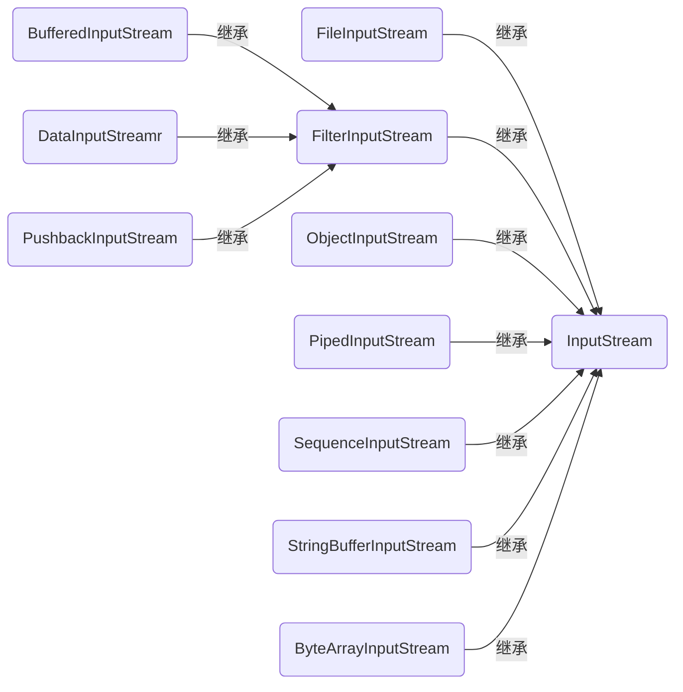
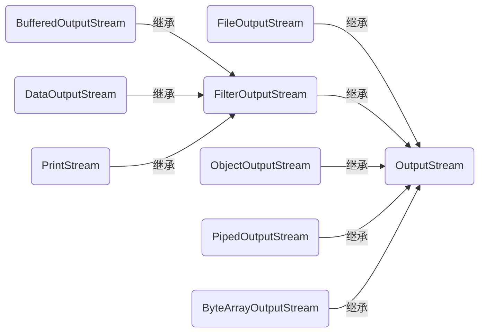
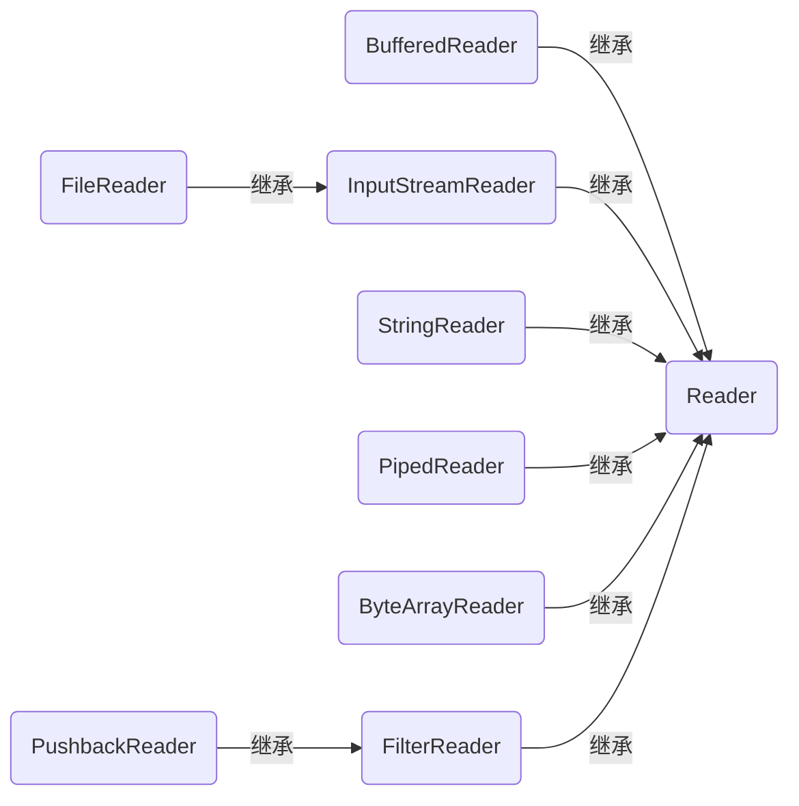
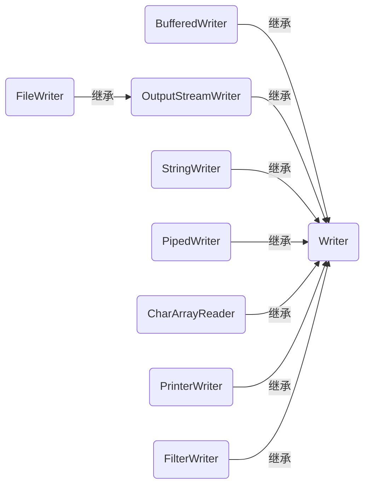

<!-- TOC -->
* [写在前面](#写在前面)
* [一、IO流介绍](#一io流介绍)
  * [1.什么是IO](#1什么是io)
  * [2.什么是“流”](#2什么是流)
  * [3.Serializable接口](#3serializable接口)
  * [4.IO流的分类](#4io流的分类)
  * [2. File类的构造方法](#2-file类的构造方法)
  * [3.File类常用方法](#3file类常用方法)
* [三、IO流之字节流](#三io流之字节流)
  * [1.什么是字节流](#1什么是字节流)
      * [3.1.2.用法](#312用法)
    * [3.2. FileInputStream类](#32-fileinputstream类)
      * [3.2.1.定义以及常用方法](#321定义以及常用方法)
      * [3.2.2.用法](#322用法)
    * [3.3.BufferedInputStream类](#33bufferedinputstream类)
      * [3.3.1.定义及常用方法](#331定义及常用方法)
      * [3.3.2.用法](#332用法)
* [](#)
    * [4.1.OutputStream类](#41outputstream类)
      * [4.1.1.定义与常用方法](#411定义与常用方法)
      * [4.1.2.用法](#412用法)
    * [4.2.FileOutputStream类](#42fileoutputstream类)
      * [4.2.1.定义与常用方法](#421定义与常用方法)
      * [4.2.2.用法](#422用法)
    * [4.3.BufferedOutputStream 类](#43bufferedoutputstream-类)
      * [4.3.1.定义与常用方法](#431定义与常用方法)
      * [4.3.2.用法](#432用法)
  * [1.什么是字符流](#1什么是字符流)
    * [3.2.InputStreamReader类](#32inputstreamreader类)
      * [3.2.1.定义及常用方法](#321定义及常用方法)
    * [3.3.FileReader类](#33filereader类)
      * [3.3.1.定义及常用方法](#331定义及常用方法-1)
    * [3.4.BufferedReader类](#34bufferedreader类)
      * [3.4.1.定义及常用方法](#341定义及常用方法)
      * [3.4.2.用法](#342用法)
  * [4.字符输出流（Writer）](#4字符输出流writer)
    * [4.2.InputStreamWriter类](#42inputstreamwriter类)
      * [4.2.1.定义及常用方法](#421定义及常用方法)
    * [4.3.FileWriter类](#43filewriter类)
      * [4.3.1.定义及常用方法](#431定义及常用方法)
    * [4.4.BufferedWriter类](#44bufferedwriter类)
      * [4.4.1.定义及常用方法](#441定义及常用方法)
    * [4.5.字符输出流用法](#45字符输出流用法)
* [五、IO流之Scanner类](#五io流之scanner类)
  * [4.Scanner关闭问题](#4scanner关闭问题)
* [七、总结](#七总结)
* [写在后面](#写在后面)
<!-- TOC -->

# 写在前面

<font face="KaiTi">
&#8195;&#8195; 这是我专栏<font color=red size=5 face="STCAIYUN">IO流</font>的第一篇博文。同时也是Java中IO操作的基础。为后续讲解NIO、BIO、AIO等技术奠定一个基础，那么话不多说开始今天的内容。</font>

# 一、IO流介绍
## 1.什么是IO
<font face="KaiTi">&#8195;&#8195; IO（输入输出）是指计算机同外部设备之间的数据传递。常见的输入输出设备有文件、键盘、打印机、屏幕等。数据可以按记录（或称数据块）的方式传递，也可以 流的方式传递。</font>
<font face="KaiTi">&#8195;&#8195; 那么对于输入和输出应该怎么去理解呢？其实很简单，当你内存中写入数据时这个操作就是输入（input），当你将内存中的数据写入到硬盘中时这个操作就叫输出（output）。比如说读取文件就是是input，保存（写入）文件就是output。</font>

## 2.什么是“流”
<font face="KaiTi">&#8195;&#8195; “流”是一种抽象概念，它表示数据的无结构化传递。按照流的方式进行输入输出，数据被当成无结构的字节序或字符序列。从流中取得数据的操作称为提取操作，而向流中添加数据的操作称为插入操作。</font>
<font face="KaiTi">&#8195;&#8195;当然这么说偏向于官方文档上的说明，那么怎么理解“流”这个概念呢？举个例子，在一桶水（数据）里放入一些带颜色的颗粒（数据块），将它转移到另一个水桶中。第一种方法，用水管将桶里的水转移到另一个桶中，在转移的过程中可以看到这些颗粒每次转移的顺序是不一定的。还有一种方法就是将水冻成冰，然后直接倒入另一个桶中，在这个过程中颗粒的位置没有发生变化。不管是那种方法最后数据都成功转移了，区别是数据块转移顺序的变化。第一种转移方法就是类似于“流”。</font>
<font face="KaiTi">&#8195;&#8195;那么，可能有人就会想，数据块位置变了那么数据不也就变了吗？其实我以前也这么想过，但是后来阅读了源码发现IO流操作是会涉及到一个接口：Serializable接口（序列化）。而正是由于这个接口才使得我们的数据在传输前后不会改变。</font>

## 3.Serializable接口
<font face="KaiTi">&#8195;&#8195;Serializable接口仅为标记接口，不包含任何方法定义。因此实现Serializable接口的类不需要重写任何方法。</font>
<font face="KaiTi">&#8195;&#8195;当一个类实现了Serializable接口，表示该类可以序列化，序列化的目的是将一个实现了Serializable接口的对象可以转换成一个字节序列，保存对象的状态。正是因为这个接口才能在数据传输前后保证数据的一致性。（PS：Serializable接口实现原理会单独放到一篇博文里讲，这里不赘述。）</font>

## 4.IO流的分类
<font face="KaiTi">&#8195; &#8195;先看下IO流的结构图，如图1.4.1所示：</font>


<center><font face="KaiTi">图 1.4.1</font></center>

<font face="KaiTi">&#8195;&#8195;其实IO流的分类不止这一种，比如按照读写方式可分为输入流和输出流，这里之所以这么分类是为了后面讲解字符流与字节流之间的相互转换。</font>
# 二、IO基础之File类
<font face="KaiTi">&#8195;&#8195;之所以把File类放在这个位置讲解是因为后面的字符流/字节流都会涉及到文件的操作。下面来看看File类的具体内容：</font>
## 1. File类介绍
<font face="KaiTi">&#8195;&#8195;Java中File类以抽象的方式代表文件名和目录路径名。该类主要用于文件和目录的创建、文件的查找和文件的删除等。即可以通过new File(String string)去操作文件或者目录。</font>

## 2. File类的构造方法
构造方法     | 说明
-------- | -----
File(String child, File parent)  | 通过给定的父路径名和子路径名字符串创建一个新的File实例
File(String pathname)   | 通过将给定路径名字符串转换成路径名来创建一个新 File 实例
File(String parent, String child)  | 根据 parent 路径名字符串和 child 路径名字符串创建一个新 File 实例
File(URI uri) | 通过将给定的 file: URI 转换成一个路径名来创建一个新的 File 实例

<font face="KaiTi">前三种可以说是最常用的构造方法，用来读取本地文件。最后一种通过生成一个URI对象实例的形式可以用来解析网络资源。属于HTTP协议中的的内容这里不是讲解的重点，所以不再赘述。</font>

&#8195; &#8195;**URI**：统一资源标识符&#8195; 

    &#8195;**URL**：统一资源定位符

```java
	// 假设桌面有个文件叫a.txt
	String dirName = "C:\\Users\\User\\Desktop";
	String fileName = "a.txt";
	String path = dirName+"\\"+fileName;
	File file1 = new File(path);
	File file2 = new File(dirName,fileName);
	File file3 = new Flei(new File(firName),fileName);
```
## 3.File类常用方法
|序号     | 方法名 | 返回值类型 | 方法说明|
|:-------- |:-----|:-----:|:------|
|1  | getName() | String | 返回由此路径名表示的文件或目录的名称|
|2  | getParent() | String | 返回此路径名的父路径名的路径名字符串，如果此路径名没有指定父目录，则返回 null|
|3  | getParentFile() | File | 返回此路径名的父路径名的抽象路径名，如果此路径名没有指定父目录，则返回 null|
|4  | getPath() | String | 将此路径名转换为一个路径名字符串|
|5  |  isAbsolute() | boolean | 测试此路径名是否为绝对路径|
|6  | getAbsolutePath() | String | 返回路径名的绝对路径名字符串|
|7  | canRead() | boolean | 测试该文件是否可读|
|8  | canWrite() | boolean | 测试该文件是否可写|
|9  | exists() | boolean | 测试文件或目录是否存在|
|10  | isDirectory() | boolean | 测试该路径名表示的文件是否是目录|
|11  | isFile() | boolean | 测试此路径名表示的文件是否是一个标准文件|
|12  | lastModified() | long | 返回此路径名表示的文件最后一次被修改的时间（毫秒数）|
|13  | length() | long | 返回由此路径名表示的文件的长度|
|14  | createNewFile() | boolean | 当且仅当不存在具有此路径名指定的名称的文件时，原地创建由此路径名指定的一个新的空文件（可能会抛出IOException）|
|15  | delete() | boolean | 删除此路径名表示的文件或目录（在文件系统中直接删除，不经过回收站）|
|16  | deleteOnExit() | void | 在虚拟机终止时，请求删除此路径名表示的文件或目录（在文件系统中直接删除，不经过回收站）|
|17  | list() | String[] | 返回由此路径名所表示的目录中的文件和目录的名称所组成字符串数组|
|18  | list(FilenameFilter filter) | String[] | 返回由包含在目录中的文件和目录的名称所组成的字符串数组，这一目录是通过满足指定过滤器的路径名来表示的|
|19  | listFiles() | File[] | 返回一个路径名数组，这些路径名表示此抽象路径名所表示目录中的文件|
|20  | listFiles(FileFilter filter) |  File[] | 返回表示此路径名所表示目录中的文件和目录的路径名数组，这些路径名满足特定过滤器|
|21  | mkdir() | boolean | 创建此路径名指定的目录，如果父路径不存在则创建失败|
|22  | mkdirs() | boolean | 创建此路径名指定的目录，如果父目录不存在则会先创建父目录再创建子目录|
|23  | renameTo(File dest) | boolean | 重命名此路径名表示的文件|
|24  | setLastModified(long time) | boolean | 设置由此路径名所指定的文件或目录的最后一次修改时间（参数为毫秒数）|
|25  | setReadOnly() | boolean | 设置只读|
|26  | createTempFile(String prefix, String suffix, File directory) |  File | 在指定目录中创建一个新的空文件，使用给定的前缀和后缀字符串生成其名称|
|27  | createTempFile(String prefix, String suffix) | File | 在默认临时文件目录中创建一个空文件，使用给定前缀和后缀生成其名称|
|28  | compareTo(File pathname) | int | 按字母顺序比较两个路径名|
|29  | compareTo(Object o) | int | 按字母顺序比较路径名与给定对象|
|30  | equals(Object o) | boolean | 测试此路径名与给定对象是否相等|
|31  | toString() | String | 返回此路径名的路径名字符串|
|||||

<font face="KaiTi">&#8195;&#8195;看完这些方法，我们知道File类可以实现文件/目录的创建与删除、文件信息的获取（比如：文件名，文件大小等等）、设置文件属性（只读）等，==不支持读写文件，因为File类不属于流==。在进行这些操作之前特别是涉及到文件的读写，笔者建议先调用exists()方法，以避免出现错误。下面看一个小demo：读取桌面上名为a.txt的文件信息。</font>

```java
public class demo {
    public static void main(String[] args) {
        File file = new File("C:\\Users\\woodenYi\\Desktop\\a.txt");
        System.out.println("文件" + (file.exists() ? "存在" : "不存在") + ",文件名：" + file.getName());
        System.out.println("文件" + (file.exists() ? "存在" : "不存在") + ",最后修改时间：" + file.lastModified() + "(" + new Date(file.lastModified()) + ")");
        System.out.println("文件" + (file.exists() ? "存在" : "不存在") + ",文件大小：" + file.length());
        System.out.println("文件" + (file.exists() ? "存在" : "不存在") + ",文件删除" + (file.delete() ? "成功" : "失败"));
        System.out.println("---------------------------------------------------------------------------------------------");
    }
}

```
<font face="KaiTi">执行结果：</font>

- <font face="KaiTi">当文件不存在时：</font>

> 文件不存在,文件名：a.txt
> 文件不存在,最后修改时间：0(Thu Jan 01 08:00:00 CST 1970)
> 文件不存在,文件大小：0
> 文件不存在,文件删除失败
---------------------------------------------------------------------------------------------
- <font face="KaiTi">当文件存在时：</font>

> 文件存在,文件名：a.txt
> 文件存在,最后修改时间：1585471143427(Sun Mar 29 16:39:03 CST 2020)
> 文件存在,文件大小：276
> 文件存在,文件删除成功

<font face="KaiTi">&#8195;&#8195;这里可以很明显的看到当文件不存在时，文件的最后修改时间是计算机时间的起始时间。但是发现可以解析到文件名，这是因为文件名获取是直接通过路径来解析的。这是在我们知道自己的OS使用哪类字符来进行路径分割的情况下。如果你不知道你的OS使用的是哪类分割符，那也没关系，Java提供了两类四个常量来获取OS的分隔符。这部分可以参看File类的源码，里面的实现很简单，并且也不是我们的讨论重点，所以不再赘述。</font>


# 三、IO流之字节流
## 1.什么是字节流
<font face="KaiTi">&#8195;&#8195;在数据传输过程中，传输数据的最基本单位是字节的流。</font>
## 2.字节流的分类
<font face="KaiTi">&#8195;&#8195;按照数据传输的方式分为输入流和输出流。其基类分别是：InputStream和OutputStream，即，输入流继承自InputStream，输出流继承自OutputStream。</font>
## 3.字节输入流（InputStream）
<font face="KaiTi">字节输入流的继承关系图：</font>


<font face="KaiTi">下面介绍下几个常用的字节输入流：</font>
### 3.1.InputStream类
#### 3.1.1.定义以及常用方法
<font face="KaiTi">&#8195;&#8195;InputStream是字节输入流的抽象基类 ,InputStream作为基类，给它的基类定义了几个通用的函数：</font>

- <font face="KaiTi">read(byte[] b)：从流中读取`b.length()`个字节的数据存储到b中，返回结果是读取的字节个数（如果返回-1说明到了结尾，没有了数据）；</font>
- <font face="KaiTi">read(byte[] b, int off, int len)：从流中从off的位置开始读取len个字节的数据存储到b中，返回结果是实际读取到的字节个数（如果返回-1说明到了结尾，没有了数据）；</font>
- <font face="KaiTi">close()：关闭流，释放资源；</font>
#### 3.1.2.用法
<font face="KaiTi">&#8195;&#8195;InputStream是抽象基类，所以它不可以创建对象，但它可以用来“接口化编程”，因为大部分子类的函数在基类中都有定义，所以利用基类来调用函数。</font>

```java
InputStream inputStream = new FileInputStream(new File("xxx/xxx.txt"));
System.out.println(inputStream.read(new byte[1024]));
```

### 3.2. FileInputStream类
#### 3.2.1.定义以及常用方法
<font face="KaiTi">&#8195;&#8195;FileInputStream主要用来操作文件输入流，它除了可以使用基类定义的函数外,它还实现了基类的read()函数：</font>

- <font face="KaiTi">read():从流中读取1个字节的数据，返回结果是一个int，（如果编码是以一个字节一个字符的，可以尝试转成char，用来查看数据）；</font>
#### 3.2.2.用法
<font face="KaiTi">&#8195;&#8195;FileInputStream是用来读文件数据的流，所以它需要一个文件对象用来实例化，这个文件可以是一个File对象,也可以是文件名路径字符串。如果文件不存在会抛出FileNotFoundException。</font>
<font face="KaiTi">&#8195;&#8195;这里就举个例子看下FileInputStream的用法，给定一个文件a.txt，文件内容是：“我是测试文件，我希望被FileInputStream读取(回车)读到Java了(回车回车)”将文件中的内容打印在IDE的控制台中，并统计字节数。</font>

```java
public class demo {
    public static void main(String[] args) {
        // 创建文件对象
        File file = new File("C:\\Users\\woodenYi\\Desktop\\a.txt");
        // 定义变量count，用于统计文件字节长度
        int count = 0;
        // 定义一个字节数组bytes，表示每次读取的字节数
        byte[] bytes = new byte[4];
        // 定义变量length，记录按照bytes读取的长度
        int length = 0;
        // 定义变量string，用来存储文件内容
        String string = "";
        // 如果文件不存在 则抛出RuntimeException()
        if (!file.exists()){
            throw new RuntimeException("文件不存在！");
        }
        try (InputStream inputStream = new FileInputStream(file)){
            // read() 表示每次只读取一个字节
            while (inputStream.read()!=-1){
                count ++;
            }
        } catch (FileNotFoundException e) {
            e.printStackTrace();
        } catch (IOException e) {
            e.printStackTrace();
        }
        try(InputStream inputStream = new FileInputStream(file)){
            // 每次读取按照bytes。length个字节去读
            while ((length = inputStream.read(bytes))!=-1){
                string += new String(bytes,0,length);
            }
        } catch (FileNotFoundException e) {
            e.printStackTrace();
        } catch (IOException e) {
            e.printStackTrace();
        }

        System.out.println("文件"+file.getName()+"共有"+file.length()+"字节");
        System.out.println("文件"+file.getName()+"共有"+count+"字节");
        System.out.println("==================================================");
        System.out.println("文件"+file.getName()+"内容：\n"+string);
        System.out.println("==================================================");
    }
}
```
<font face="KaiTi">执行结果：</font>

```text
文件a.txt共有73字节
文件a.txt共有73字节
==================================================
文件a.txt内容：
我�����试文�����我希�����FileInputStream读���
读���Java��
 
 
 ==================================================
```


<font face="KaiTi">从代码和运行结果可以看出①read()方法读到文件末尾会返回-1；②read()方法调用次数=文件大小（字节数）/每次读取的字节数；③如果字节数设置不合理会导致读出的文件内容产生乱码。 </font>
<font face="KaiTi">&#8195;&#8195;在使用read(byte[] byte)方法是建议最小读取字节数为1024字节或者1024字节的整数倍，这样才能有效避免出现乱码现象。在上面的代码中将最小读写单元改成1024字节后运行结果：</font>

```bash
文件a.txt共有73字节
文件a.txt共有73字节
==================================================
文件a.txt内容：
我是测试文件，我希望被FileInputStream读取
读到Java了
  
   
==================================================
```
### 3.3.BufferedInputStream类
#### 3.3.1.定义及常用方法
<font face="KaiTi">&#8195;&#8195;BufferedInputStream带有缓冲的意思，普通的流是从硬盘里面读，而带有缓冲区之后，BufferedInputStream先将数据封装到内存中，再从内存中操作数据，因此它的效率要比普通的流（eg:FileInputStream）的要高，所以又被称为缓冲流或高级流。需要注意的是BufferedInputStream并不是InputStream的直接子类，而是FilterInputStream的子类，这一点可以从上面的继承图看出来。它除了可以使用基类定义的函数外,它还实现了基类的read()函数（无参的）：</font>

- <font face="KaiTi">read():从流中读取1个字节的数据，返回结果是一个int（如果编码是以一个字节一个字符的，则可以尝试转成char，用来查看数据）；</font>
#### 3.3.2.用法
<font face="KaiTi">&#8195;&#8195;BufferedInputStream作为高级流，它可以嵌套在其他低级流上使用。这里同样用FileInputStream里的例子做演示：</font>

```java
public class demo {
    public static void main(String[] args) {
        // 创建文件对象
        File file = new File("C:\\Users\\woodenYi\\Desktop\\a.txt");
        // 定义变量count，用于统计文件字节长度
        int count = 0;
        // 定义一个字节数组bytes，表示每次读取的字节数
        byte[] bytes = new byte[4];
        // 定义变量length，记录按照bytes读取的长度
        int length = 0;
        // 定义变量string，用来存储文件内容
        String string = "";
        // 如果文件不存在 则抛出RuntimeException()
        if (!file.exists()){
            throw new RuntimeException("文件不存在！");
        }
        // 将BufferedInputStream嵌套在FileInputStream上
        try (InputStream inputStream = new BufferedInputStream(new FileInputStream(file))){
            // read() 表示每次只读取一个字节
            while (inputStream.read()!=-1){
                count ++;
            }
        } catch (FileNotFoundException e) {
            e.printStackTrace();
        } catch (IOException e) {
            e.printStackTrace();
        }
        try(InputStream inputStream = new BufferedInputStream(new FileInputStream(file))){
            // 每次读取按照bytes。length个字节去读
            while ((length = inputStream.read(bytes))!=-1){
                string += new String(bytes,0,length);
            }
        } catch (FileNotFoundException e) {
            e.printStackTrace();
        } catch (IOException e) {
            e.printStackTrace();
        }

        System.out.println("文件"+file.getName()+"共有"+file.length()+"字节");
        System.out.println("文件"+file.getName()+"共有"+count+"字节");
        System.out.println("==================================================");
        System.out.println("文件"+file.getName()+"内容：\n"+string);
        System.out.println("==================================================");
    }
}
```
<font face="KaiTi">执行结果：</font>

```text
文件a.txt共有73字节
文件a.txt共有73字节
==================================================
文件a.txt内容：
我�����试文�����我希�����FileInputStream读���
读���Java��
 
 
 ==================================================
```
<font face="KaiTi">从代码和运行结果可以看出BufferedInputStream和FileInputStream几乎相同，不同的是在操作文件的效率上，这里不做演示 ，感兴趣可以自己试试用BufferedInputStream和FileInputStream去操作同一个大文件，感受下执行效率的差异。这里同样将最小读写单元改成1024字节后，看下运行结果：</font>
```bash
文件a.txt共有73字节
文件a.txt共有73字节
==================================================
文件a.txt内容：
我是测试文件，我希望被FileInputStream读取
读到Java了
  
   
==================================================
```

## 4. 字节输出流（OutputStream）
<font face="KaiTi">字节输出流的继承关系图：</font>

<font face="KaiTi">这一部分建议大家对比字节输入流去看，下面介绍下几个常用的字节输入流：</font>

### 4.1.OutputStream类
#### 4.1.1.定义与常用方法
<font face="KaiTi">&#8195;&#8195;OutputStream是字节输出流的基类， OutputStream作为基类，给它的基类定义了几个通用的函数：</font>

- <font face="KaiTi">write(byte[] b):将`b.length()`个字节数据写到输出流中；</font>
- <font face="KaiTi">write(byte[] b,int off,int len):从b的off位置开始，获取len个字节数据，写到输出流中；</font>
- <font face="KaiTi">flush():刷新输出流，把数据马上写到输出流中；</font>
- <font face="KaiTi">close():关闭流，释放系统资源；</font>

#### 4.1.2.用法
<font face="KaiTi">&#8195;&#8195;OutputStream和InputStream一样都是抽象基类，在用法上也一样。</font>

```java
OutputStream outputStream = new FileOutputStream(file);
outputStream.write(bytes);
outputStream.close();
```

### 4.2.FileOutputStream类
#### 4.2.1.定义与常用方法
<font face="KaiTi">&#8195;&#8195;FileOutputStream是用于写文件的输出流，它除了可以使用基类定义的函数外,还实现了OutputStream的抽象函数write(int b):</font>
- <font face="KaiTi">write(int b):将b转成一个字节数据，写到输出流中；</font>

#### 4.2.2.用法
<font face="KaiTi">&#8195;&#8195;FileOutputStream需要一个文件作为实例化参数，这个文件可以是File对象，也可以是文件路径字符串（**如果文件不存在，那么将自动创建**）。FileOutputStream实例化时可以给第二个参数，第二个参数表示是否使用追加写入，为true时代表在原有文件内容后面追加写入数据，默认为false。</font>
<font face="KaiTi">&#8195;&#8195;这里还是用一个例子去了解一下FileOutputStream，需求如下：将a.txt中的内容读取出来写入b.txt中，读取b.txt。再将“我是FileOutputStream写入内容”写入b.txt中，此时使用追加写入和覆盖写入，再读取出b.txt的内容。</font>

```java
public class demo1 {
    public static void main(String[] args) {
        String source = "C:\\Users\\woodenYi\\Desktop\\a.txt";
        String target = "C:\\Users\\woodenYi\\Desktop\\b.txt";
        String text = "我是FileOutputStream写入内容";
        // 调用追加写入方法
        Thread thread1 = new Thread(()->{
            additionalWrite(source,target,text);
        });
        // 调用覆盖写入函数
        Thread thread2 = new Thread(()->{
            overwrite(source,target,text);
        });
        thread1.start();
        // 这里做一个阻塞操作 是打印的内容更直观
        try {
            Thread.sleep(1000);
        } catch (InterruptedException e) {
            e.printStackTrace();
        }
        thread2.start();
    }

    /**
     * 追加写入text
     * @param source 源文件路径
     * @param target 目标文件路径
     * @param text 写入内容
     */
    public static void additionalWrite(String source,String target,String text){
        // 调用内容转移方法
        contentTransfer(source,target);
        // 创建输入输出流
        InputStream in = null;
        OutputStream out = null;
        // 将text写入 target中
        try {
            out = new FileOutputStream(target,true);
            out.write(text.getBytes());
        } catch (FileNotFoundException e) {
            e.printStackTrace();
        } catch (IOException e) {
            e.printStackTrace();
        }finally {
            if (out != null) {
                try {
                    out.close();
                } catch (IOException e) {
                    e.printStackTrace();
                }
            }
        }
        // 创建变量bytes 存储读到的内容
        byte[] bytes = new byte[1024];
        int length = 0;
        StringBuilder string= new StringBuilder("");
        // 读取 target的内容 这里因为先调用了OutputStream所以不需要判断文件是否存在
        try {
            in = new FileInputStream(target);
            while ((length =in.read(bytes))!=-1){
                System.out.println(length);
                string.append(new String(bytes, 0, length));
            }
        } catch (FileNotFoundException e) {
            e.printStackTrace();
        } catch (IOException e) {
            e.printStackTrace();
        } finally {
            if (in != null) {
                try {
                    in.close();
                } catch (IOException e) {
                    e.printStackTrace();
                }
            }
        }
        System.out.println("============追加写入后["+target+"]中的内容============");
        System.out.println(string.toString());
        System.out.println("============追加写入输出完毕============\n");
        // 为保证两次测试不受影响，执行删除操作
        new File(target).delete();
    }

    /**
     * 覆盖写入text
     * @param source 源文件路径
     * @param target 目标文件路径
     * @param text 写入内容
     */
    public static void overwrite(String source,String target,String text){
        contentTransfer(source,target);
        // 创建输入输出流
        InputStream in = null;
        OutputStream out = null;
        // 将text写入 target中
        try {
            // 其实默认值就是false  这里为了区别
            out = new FileOutputStream(target,false);
            out.write(text.getBytes());
        } catch (FileNotFoundException e) {
            e.printStackTrace();
        } catch (IOException e) {
            e.printStackTrace();
        }finally {
            if (out != null) {
                try {
                    out.close();
                } catch (IOException e) {
                    e.printStackTrace();
                }
            }
        }
        // 创建变量bytes 存储读到的内容
        byte[] bytes = new byte[1024];
        int length = 0;
        StringBuilder string= new StringBuilder("");
        // 读取 target的内容 这里因为先调用了OutputStream所以不需要判断文件是否存在
        try {
            in = new FileInputStream(target);
            while ((length =in.read(bytes))!=-1){
                string.append(new String(bytes, 0, length));
            }
        } catch (FileNotFoundException e) {
            e.printStackTrace();
        } catch (IOException e) {
            e.printStackTrace();
        } finally {
            if (in != null) {
                try {
                    in.close();
                } catch (IOException e) {
                    e.printStackTrace();
                }
            }
        }
        System.out.println("============覆盖写入后["+target+"]中的内容============");
        System.out.println(string.toString());
        System.out.println("============覆盖写入输出完毕============\n");
        // 为保证两次测试不受影响，执行删除操作
        new File(target).delete();
    }

    /**
     * 将source中的内容写入target中
     * @param source 源文件路径
     * @param target 目标文件路径
     */
    public static void contentTransfer(String source,String target){
        // 创建File对象
        File file = new File(source);
        // 判断file是否存在，若源文件不存在直接throw RuntimeException
        if(!file.exists()){
            throw new RuntimeException("源文件不存在!");
        }
        // 创建变量bytes 存储读到的内容
        // 由于我这里的文件很小  所以直接使用file.length()作为字节数  否则在写入时会写入很多空格 实际应用时字节数视实际情况而定
        byte[] bytes = new byte[(int) file.length()];
        int length = 0;
        StringBuilder string= new StringBuilder("");
        // 创建输入流和输出流
        InputStream in = null;
        InputStream newIn = null;
        OutputStream out = null;
        try {
            in = new FileInputStream(file);
            out = new FileOutputStream(target);
            newIn = new FileInputStream(target);
            // 读取source并写入target
            while (in.read(bytes) !=-1){
                out.write(bytes);
            }
            // 读取target
            while ((length =newIn.read(bytes))!=-1){
                string.append(new String(bytes, 0, length));
            }
        } catch (FileNotFoundException e) {
            e.printStackTrace();
        } catch (IOException e) {
            e.printStackTrace();
        }finally {
            try {
                if (in != null) {
                    in.close();
                }
                if (newIn != null) {
                    newIn.close();
                }
                if (out != null) {
                    out.close();
                }
            } catch (IOException e) {
                e.printStackTrace();
            }
        }
        System.out.println("============从["+source+"]中转移到["+target+"]后的内容=========================");
        System.out.println(string.toString());
        System.out.println("===============转移内容读取完毕======================\n");
    }
}
```
<font face="KaiTi">执行结果：</font>

```text
============从[C:\Users\woodenYi\Desktop\a.txt]中转移到[C:\Users\woodenYi\Desktop\b.txt]后的内容=========================
我是测试文件，我希望被FileInputStream读取

读到Java了


===============转移内容读取完毕======================

109
============追加写入后[C:\Users\woodenYi\Desktop\b.txt]中的内容============
我是测试文件，我希望被FileInputStream读取

读到Java了

我是FileOutputStream写入内容
============追加写入输出完毕============

============从[C:\Users\woodenYi\Desktop\a.txt]中转移到[C:\Users\woodenYi\Desktop\b.txt]后的内容=========================
我是测试文件，我希望被FileInputStream读取

读到Java了


===============转移内容读取完毕======================

============覆盖写入后[C:\Users\woodenYi\Desktop\b.txt]中的内容============
我是FileOutputStream写入内容
============覆盖写入输出完毕============

```

### 4.3.BufferedOutputStream 类
#### 4.3.1.定义与常用方法
<font face="KaiTi">&#8195;&#8195;BufferedOutputStream像上面那个BufferedInputStream一样，都可以提高效率。它除了可以使用基类定义的函数外,它还实现了OutputStream的抽象函数write(int b):</font>
- <font face="KaiTi">write(int b):将b转成一个字节数据，写到输出流中</font>

#### 4.3.2.用法
<font face="KaiTi">&#8195;&#8195;BufferedOutputStream需要一个输出流作为实例化参数，具体用法与上面的BufferedInputStream大同小异。</font>
# 四、IO流之字符流

## 1.什么是字符流
<font face="KaiTi">&#8195;&#8195;在数据传输过程中，传输数据的最基本单位是字符的流。</font>
## 2.字符流的分类
<font face="KaiTi">&#8195;&#8195;按照数据传输的方式分为输入流和输出流。其基类分别是：Reader和Writer，即，输入流继承自Reader，输出流继承自Writer。</font>
## 3.字符输入流（Reader）
<font face="KaiTi">字符输入流的继承关系图：</font>

### 3.1.Reader类
#### 3.1.1.定义及常用方法
<font face="KaiTi">&#8195;&#8195;Reader是字符输入流的抽象基类 ,它定义了以下几个函数：</font>
- <font face="KaiTi">read() ：读取单个字符，返回结果是一个int，到达流的末尾时，返回-1</font>
- <font face="KaiTi">read(char[] cbuf):读取`cbuf.length()`个字符到cbuf中，返回结果是读取的字符数，到达流的末尾时，返回-1</font>
- <font face="KaiTi">close()  ：关闭流，释放占用的系统资源</font>
#### 3.1.2.用法
<font face="KaiTi">&#8195;&#8195;Reader不能实例化，用于“接口化编程”</font>

```java
Reader reader = new FileReader("a.txt");
reader.read();
```

### 3.2.InputStreamReader类
#### 3.2.1.定义及常用方法
<font face="KaiTi">&#8195;&#8195;InputStreamReader 可以把InputStream中的字节数据流根据字符编码方式转成字符数据流。它除了可以使用基类定义的函数，它自己还实现了以下函数：</font>
- <font face="KaiTi">read(char[] cbuf, int offset, int length) ：从offset位置开始，读取length个字符到cbuf中，返回结果是实际读取的字符数，到达流的末尾时，返回-1</font>
#### 3.2.2.用法
<font face="KaiTi">&#8195;&#8195;InputStreamReader需要一个字节输入流对象作为实例化参数。还可以指定第二个参数，第二个参数是字符编码。</font>

```java
InputStreamReader isr1 = new InputStreamReader(new FileInputStream("a.txt"));
isr1.read();
InputStreamReader isr2 = new InputStreamReader(new FileInputStream("a.txt"),"utf8");
isr2.read();
```

### 3.3.FileReader类
#### 3.3.1.定义及常用方法
<font face="KaiTi">&#8195;&#8195;FileReader它是InputStreamReader的子类，可以把FileInputStream中的字节数据转成根据字符编码方式转成字符数据流</font>
#### 3.3.2.用法
<font face="KaiTi">&#8195;&#8195;FileReader 需要一个文件对象作为实例化参数，可以是File类对象，也可以是文件的路径字符串</font>
```java
FileReader reader = new FileReader("a.txt");
reader.read();
```

### 3.4.BufferedReader类
#### 3.4.1.定义及常用方法
<font face="KaiTi">&#8195;&#8195;BufferedReader可以把字符输入流进行封装，将数据进行缓冲，提高读取效率。是一个高级流，它除了可以使用基类定义的函数，它自己还实现了以下函数：</font>
- <font face="KaiTi">read(char[] cbuf, int offset, int length) ：从offset位置开始，读取length个字符到cbuf中，返回结果是实际读取的字符数，到达流的末尾时，返回-1</font>
- <font face="KaiTi">readLine() ：按行读取，以行结束符作为末尾，返回结果是读取的字符串。如果已到达流末尾，则返回 null</font>

#### 3.4.2.用法
<font face="KaiTi">&#8195;&#8195;BufferReader需要一个字符输入流对象作为实例化参数，需要和其他流嵌套配合使用。</font>

```java
BufferedReader bfr = new BufferedReader(new FileReader("a.txt"));
bfr.readLine();
```

## 4.字符输出流（Writer）
<font face="KaiTi">字符输出流的继承关系图：</font>

### 4.1.Writer类
#### 4.1.1.定义及常用方法
<font face="KaiTi">&#8195;&#8195;Writer是字符输出流的抽象基类， ,它定义了以下几个函数：</font>
- <font face="KaiTi">write(char[] cbuf) :往输出流写入一个字符数组</font>
- <font face="KaiTi">write(int c) ：往输出流写入一个字符</font>
- <font face="KaiTi">write(String str) ：往输出流写入一串字符串</font>
- <font face="KaiTi">write(String str, int off, int len) :往输出流写入字符串的一部分</font>
- <font face="KaiTi">close() ：关闭流，释放资源（抽象方法）</font>
- <font face="KaiTi">flush()：刷新输出流，把数据马上写到输出流中（抽象方法）</font>

### 4.2.InputStreamWriter类
#### 4.2.1.定义及常用方法
<font face="KaiTi">&#8195;&#8195;OutputStreamWriter可以使我们直接往流中写字符串数据，它里面会帮我们根据字符编码方式来把字符数据转成字节数据再写给输出流。</font>

### 4.3.FileWriter类
#### 4.3.1.定义及常用方法
<font face="KaiTi">&#8195;&#8195;FileWriter与OutputStreamWriter功能类似，我们可以直接往流中写字符串数据，FileWriter内部会根据字符编码方式来把字符数据转成字节数据再写给输出流</font>

### 4.4.BufferedWriter类
#### 4.4.1.定义及常用方法
<font face="KaiTi">&#8195;&#8195;BufferedWriter利用了缓冲区来提高写的效率。它还多出了一个函数：</font>
- <font face="KaiTi">newLine() ：写入一个换行符</font>

### 4.5.字符输出流用法
<font face="KaiTi">&#8195;&#8195;字符输出流的用法与字符输入流的用法几乎相同，这里不再去展示演示代码了。可以对比字符输入流去学习。</font>

# 五、IO流之Scanner类
<font face="KaiTi">&#8195;&#8195;Scanner这个类都不陌生，初学Java时一定都用过。他的功能就好像是C++里的cin用来获取键盘输入的字符。至于为什么把Scanner放在IO流中是因为Scanner本就是一个输入流，虽然Scanner类不在java.io包中。</font>
## 1.Scanner类简介
<font face="KaiTi">&#8195;&#8195;Java 5添加了java.util.Scanner类，这是一个用于扫描输入文本的新的实用程序。它是以前的StringTokenizer和Matcher类之间的某种结合。由于任何数据都必须通过同一模式的捕获组检索或通过使用一个索引来检索文本的各个部分。于是可以结合使用正则表达式和从输入流中检索特定类型数据项的方法。这样，除了能使用正则表达式之外，Scanner类还可以任意地对字符串和基本类型(如int和double)的数据进行分析。借助于Scanner，可以针对任何要处理的文本内容编写自定义的语法分析器。</font>
## 2.Scanner构造器及常用方法
### 1.构造器
<font face="KaiTi">&#8195;&#8195;Scanner的构造器支持多种方式，可以从字符串（Readable）、输入流、文件等等来直接构建Scanner对象。</font>
### 2.常用方法
- <font face="KaiTi">delimiter() ：返回此 Scanner 当前正在用于匹配分隔符的 Pattern。</font>
- <font face="KaiTi">hasNext() ：判断扫描器中当前扫描位置后是否还存在下一个标记（字符，文本等等）</font>
- <font face="KaiTi">hasNextLine() ：如果在此扫描器的输入中存在另一行，则返回 true</font>
- <font face="KaiTi">next() ：查找并返回来自此扫描器的下一个完整标记</font>
- <font face="KaiTi">nextLine() ：此扫描器执行当前行，并返回信息</font>
## 3.Scanner的分割符
<font face="KaiTi">&#8195;&#8195;Scanner默认使用空格作为分割符来分隔文本，但允许你指定新的分割符。</font>

```java
Scanner s = new Scanner("123 asdf。。。hjksdfojk----634345664，erg"); 
// 设置新的分割符 使用空格或逗号或点号作为分隔符
s.useDelimiter(" |,|\\."); 
```
## 4.Scanner关闭问题

```java
Scanner sc = new Scanner(System.in);
Scanner sc2 = new Scanner(System.in);
sc.close();
```
<font face="KaiTi">&#8195;&#8195;这时候你会发现sc2这个实例也没有办法使用了，这是因为sc执行close操作是把System.in也关闭了，所以导致sc2不能用。建议在Scanner操作结束后统一调用close()方法来关闭流释放系统资源。</font>
# 六、字节流与字符流转换
<font face="KaiTi">&#8195;&#8195;虽然Java支持字节流和字符流，但有时需要在字节流和字符流两者之间转换。InputStreamReader和OutputStreamWriter，这两个为类是字节流和字符流之间相互转换的类。</font>

```java
// 获取标准输入流
BufferedReader in = new BufferedReader(new InputStreamReader(System.in));

// 获取标准输出流
Writer out = new BufferedWriter(new OutputStreamWriter(System.out));
```
<font face="KaiTi">&#8195;&#8195;基于这两个操作，来实现从控制台获取输入的文字写入文件以及在获取文件内容在控制台输出。</font>

- <font face="KaiTi">从控制台获取输入的文字写入文件</font>

```java
public class demo4 {
    public static void main(String[] args) {
        // 创建字符流对象
        BufferedWriter bw = null;
        BufferedReader br = null;

        try {
            // 实例化字符流对象 通过 InputStreamReader 将字节输入流转化成字符输入流
            br = new BufferedReader(new InputStreamReader(System.in));
            bw = new BufferedWriter(new FileWriter("C:\\Users\\woodenYi\\Desktop\\c.txt"));
            // 定义读取数据的行
            String line = null;
            // 读取数据
            System.out.println("请输入要写入的信息：");
            while ((line = br.readLine()) != null) {
                // 如果输入的是"exit"就退出
                if("exit".equals(line)){
                    break;
                }
                // 将数据写入文件
                bw.write(line);
                // 写入新的一行
                bw.newLine();
                // 刷新数据缓冲
                bw.flush();
            }
        } catch (Exception e){
            e.printStackTrace();
        } finally {
            // 释放资源
            try {
                if(bw != null) {
                    bw.close();
                }
                if (br != null) {
                    br.close();
                }
            } catch (IOException e){
                e.printStackTrace();
            }
        }
        System.out.println("写入完毕！");
    }
}
```
<font face="KaiTi">执行结果</font>
```java
请输入要写入的信息：
124365787798
dsafghjjk和身体恢复功能费
大富豪都是
exit
写入完毕！
```
- <font face="KaiTi">获取文件内容在控制台输出</font>

```java
public class Demo5 {

    public static void main(String[] args) {

        // 定义字节流的对象
        BufferedReader br = null;
        BufferedWriter bw = null;
        try {
            // 实例化字节输出流 使用
            bw = new BufferedWriter(new OutputStreamWriter(System.out));
            br = new BufferedReader(new FileReader("C:\\Users\\woodenYi\\Desktop\\c.txt"));
            // 定义读取行的字符串
            String line = null;
            // 读取数据
            while ((line = br.readLine()) != null) {
                // 输出到控制台
                bw.write(line);
                // 新的一行 
                bw.newLine();
                // 刷新缓冲
                bw.flush();
            }
        } catch (Exception e){
            e.printStackTrace();
        } finally {
            // 释放资源
            try {
                if(bw != null) {
                    bw.close();
                }
                if (br != null) {
                    br.close();
                }
            }catch (Exception e){
                e.printStackTrace();
            }
        }
    }
}
```
<font face="KaiTi">执行结果</font>

```java
124365787798
dsafghjjk和身体恢复功能费
大富豪都是

```

# 七、总结
- <font face="KaiTi">流是用来表示数据的无结构化传递的抽象概念</font>
- <font face="KaiTi">在使用File进行文件操作是要先判断文件是否存在</font>
- <font face="KaiTi">在使用字节流读写文件时要选择合适的字节数来进行操作，一般选择1024字节的整数倍</font>
- <font face="KaiTi">高级流要嵌套在低级流上使用</font>
- <font face="KaiTi">不管是字节流还是字符流，它们的抽象基类只适用于“接口化编程”，不建议进行实例化</font>
- <font face="KaiTi">流在使用后一定要关闭，否则会占用系统资源</font>
- <font face="KaiTi">字节流和字符流可以通过InputStreamReader和OutputStreamWriter进行转换</font>
- <font face="KaiTi">Scanner不仅可以进行键盘读取还可以进行文件操作（虽然有现成的字符流和字节流）</font>

# 写在后面
 <font face="KaiTi">&#8195;&#8195;说实话，这篇博文从开始写到写完前后花了四天时间。究其原因还是自己对这部分内容的一些概念有些模糊不清，中间需要去翻看API文档、阅读底层源码。其实一度也想过放弃，不写这篇博文。但最后还是坚持下来了。人吧，不能有放弃的念头，更不能因为出现了放弃的念头就开始松懈，不然就只能==习惯放弃==了。这对于我们，特别是技术性岗位实在是太可怕了。一旦习惯放弃，那就要习惯被优化了。希望与诸君共勉之。</font>
 <font face="KaiTi">&#8195;&#8195;这里我要感谢一下我的徒弟，虽然平时很皮，而且还是个铁憨憨，但是我在写这篇博文的时候她陪我熬了三四夜,帮我校对一些错别字,还有提出修改建议。虽然最后呈现的博文与我自己预想的还有些差距，但是也比较满意了。希望对走在奋斗路上的你有所帮助！</font>
 <font face="KaiTi">&#8195;&#8195;我们下篇博文见！</font>
