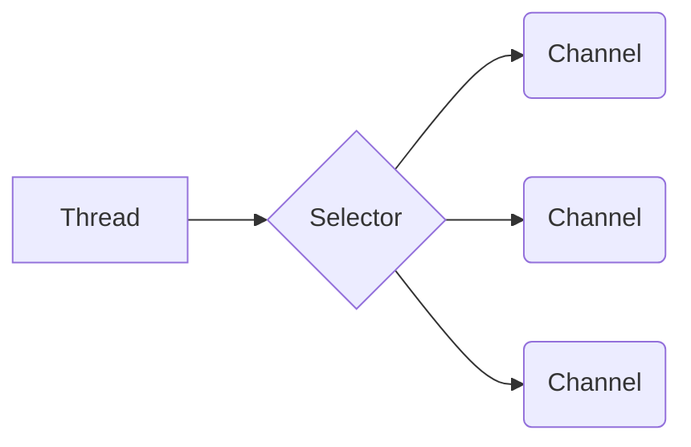

# 系列文章目录

[1.NIO系列之NIO和缓冲区(一)](https://blog.csdn.net/qq_22926739/article/details/105347329)

[2.NIO系列之NIO和缓冲区(二)](https://blog.csdn.net/qq_22926739/article/details/108635107)
<!-- TOC -->
* [系列文章目录](#系列文章目录)
* [序言](#序言)
  * [1.2 并发技术](#12-并发技术)
* [3.Buffer类介绍](#3buffer类介绍)
  * [3.1 缓冲区](#31-缓冲区)
    * [3.1.1 什么是缓冲区](#311-什么是缓冲区)
  * [3.2 Buffer类使用](#32-buffer类使用)
  * [3.2.1 Buffer类介绍](#321-buffer类介绍)
    * [3.2.2 Buffer类的使用](#322-buffer类的使用)
  * [3.3 Buffer类的相关API](#33-buffer类的相关api)
    * [3.3.1 数据包装（wrap()）和容量获取（capacity()）](#331-数据包装wrap和容量获取capacity)
<!-- TOC -->
# 序言
<font size=4 face="KaiTi">&#8195;&#8195;在前一篇博客中我们讲到了IO流（也就是常规I/O）的相关知识，那么从这篇博客开始我将开始写NIO的相关知识。</font>
<font size=4 face="KaiTi">&#8195;&#8195;在正式开始写NIO相关知识前，先简单提一下Java SE的四大核心技术：多线程，并发技术，Socket和NIO。在下文中简单的介绍下这四个核心技术中的前三个，至于NIO将在后面进行介绍。</font>
<font size=4 face="KaiTi">&#8195;&#8195;闲话少叙，开始今天的博客内容。</font>
# 1.Java SE 的四大核心技术概述
## 1.1 多线程
<font size=4 face="KaiTi">&#8195;&#8195;可以这么说，高性能解决方案离不开多线程，它可以使一个CPU在指定的单位时间里运行更多的任务（其实就是大幅度提高运行效率，让软件运行的更流畅，处理更多的数据以此来提高用户体验）。在Java中使用Thread类来实现多线程功能的处理。当然在学习多线程时，还需要重点掌握同步与异步的区别、多线程的随机性以及多线程运行乱序的可控制性的相关知识。下面补充几个概念：</font>
### 1.1.1 进程与线程
- <font size=4 face="KaiTi">进程：是资源的分配和调度的一个独立单元（这里的资源是指程序运行的资源，比如内存）</font>
- <font size=4 face="KaiTi">线程：是CPU调度的基本单元</font>

<font size=4 face="KaiTi">&#8195;&#8195;同一个进程中可以包括多个线程，并且线程共享整个进程的资源（寄存器、堆栈、上下文），一个进程至少包括一个线程。而同一个线程只能依附在一个进程中。</font>
### 1.1.2 多任务
<font size=4 face="KaiTi">&#8195;&#8195;简单地说，就是操作系统可以同时运行多个任务。打个比方，你一边在用浏览器上网，一边在听音乐，一边在用Word写文档，这就是多任务，至少同时有3个任务正在运行。还有很多任务悄悄地在后台同时运行着，只是桌面上没有显示而已。</font>
<font size=4 face="KaiTi">&#8195;&#8195;这里之所以提“多任务”是因为它是多线程编程的一个最典型的应用场景。实现多任务的思路大体上有两个：单进程多线程和多进程单线程。下面以吃饭为例子理解一下什么是单进程多线程和多进程单线程。</font>

- <font size=4 face="KaiTi">单进程多线程：多个人（线程）在一张桌子（进程）上吃饭</font>
- <font size=4 face="KaiTi">多进程单线程：多个人在多张桌子上吃饭且每张桌子上只有一个人</font>

<font size=4 face="KaiTi">&#8195;&#8195;当然这里还涉及到如何选择多任务的实现方式等问题，但这不是本文的讨论重点，在此不再赘述了。</font>

## 1.2 并发技术
<font size=4 face="KaiTi">&#8195;&#8195;由于多线程的随机性、不方便控制性还有调试麻烦这些特性也许会在实际开发中给你一些意想不到的惊喜。所以我们要使用java.util.concurrent并发包。concurrent并发包是对多线程技术的封装，使用其API可以大幅度降低代码复杂度。当然concurrent并发包的好处不仅仅如此，比如说它支持fork-join分治编程、支持计划任务等等。其实笔者推荐去深入学习concurrent并发包，应为它可以让你体会到一个不一样的Thread类，可以为你提供更广阔的多线程编程思路。</font>
## 1.3 Socket技术
<font size=4 face="KaiTi">&#8195;&#8195;在工作中和学习中经常会听到高性能服务器，其实说白了高性能服务器就是一堆服务器为一个功能提供服务。在高性能服务器的架构设计中离不开集群，而集群同样离不开Socket。Socket技术可以实现不同计算机之间的相互数据通信，从而实现了集群中服务器之间的数据交换。</font>
<font size=4 face="KaiTi">&#8195;&#8195;由于Socket技术是基于TCP/IP协议的，所以笔者建议在学习Socket编程之前先掌握TCP和UDP的常规内容。而这一部分笔者会在另一个专栏中进行较为系统的讲述，这里就不多说什么了。</font>
# 2.NIO概述
## 2.1 什么是NIO
<font size=4 face="KaiTi">&#8195;&#8195;NIO 是non-blocking的简称，jdk 1.4 引入的 java.nio 包，提供了 Channel、Selector、Buffer 等新的抽象，可以构建多路复用的、同步非阻塞 IO 程序，同时提供了更接近操作系统底层高性能的数据操作方式。</font>
<font size=4 face="KaiTi">&#8195;&#8195;Sun 官方标榜的特性如下： 为所有的原始类型提供(Buffer)缓存支持。字符集编码解码解决方案。 Channel ：一个新的原始I/O 抽象。 支持锁和内存映射文件的文件访问接口。 提供多路(non-blocking) 非阻塞式的高伸缩性网络I/O 。</font>
## 2.2 NIO与普通IO相比的优点
<font size=4 face="KaiTi">&#8195;&#8195;IO流都是阻塞的，这意味着，当一条线程执行read()或者write()方法时，这条线程会一直阻塞直到读取到了一些数据或者要写出去的数据已经全部写出，在这期间这条线程不能做任何其他的事情。</font>
<font size=4 face="KaiTi">&#8195;&#8195;NIO的非阻塞模式(Java NIO有阻塞模式和非阻塞模式，阻塞模式的NIO除了使用Buffer存储数据外和IO基本没有区别)允许一条线程从channel中读取数据，通过返回值来判断buffer中是否有数据。如果没有数据，NIO不会阻塞，因为不阻塞这条线程就可以去做其他的事情，过一段时间再回来判断一下有没有数据。NIO的写也是一样的，一条线程将buffer中的数据写入channel，它不会等待数据全部写完才会返回，而是调用完write()方法就会继续向下执行。</font>
<font size=4 face="KaiTi">&#8195;&#8195;总的来说，NIO相比于普通IO（IO流）提供了功能更强大、处理数据更快的解决方案，可以大大提升I/O的吞吐量。常被使用在高性能服务器和高性能应用软件上。</font>
## 2.3 NIO高性能的核心原理
<font size=4 face="KaiTi">&#8195;&#8195;使用较少的Thread线程通过Selector选择器来执行不同的Channel通道中的任务，再结合AIO（异步I/O）大大的提升了软件的运行效率。说白了就是用较少的线程处理更多的任务。</font>
<font size=4 face="KaiTi">原理图：</font>


# 3.Buffer类介绍
## 3.1 缓冲区
### 3.1.1 什么是缓冲区
<font size=4 face="KaiTi">&#8195;&#8195;NIO中的缓冲区实际上就是一个Buffer类，用于存储基本数据类型值的容器，类似于数组的方式存储和组织数据。</font>
### 3.1.2 缓冲区的优势
<font size=4 face="KaiTi">&#8195;&#8195;相比于传统IO流的数据存储结构（字节流的byte[]、字符流的char[]）来说，缓冲区Buffer提供了很多方法来操作数据，这大大提高了开发效率。这么说的原因是因为Java没有对Array数据提供更加方便操作数据的API，常用的操作仅有length属性和下标[x]，如果要对数据进行高级操作虽然也可以实现但是需要我们自己去实现，这样会造成代码冗余和繁杂（比如多个for循环等）。所以Java开发者在为我们提供NIO时也为我们提供了缓冲区，方便我们对数据进行高级操作。</font>

## 3.2 Buffer类使用
## 3.2.1 Buffer类介绍
<font size=4 face="KaiTi">&#8195;&#8195;首先看下Buffer类在jdk文档中的声明信息，结合申明信息来介绍和了解Buffer类。Buffer类声明信息如图3.2-1所示。</font>

<center>图 3.2-1 Buffer类声明信息</center>

<font size=4 face="KaiTi">&#8195;&#8195;从声明信息可以看出Buffer类是一个抽象类，它有七个直接子类，分别是ByteBuffer、CharBuffer、DoubleBuffer、FloatBuffer、ShortBuffer、IntBuffer、LongBuffer，也就是说Buffer缓冲区中存储的数据类型并不像普通IO流只能存储byte或char类型，缓冲区可以存储的数据是多样的。</font>

> <font size=4 face="KaiTi">注意：</font>
> <font size=4 face="KaiTi">&#8195;&#8195;1.Buffer类中没有BooleanBuffer这个子类，也就是说没有BooleanBuffer这个类。如果有人告诉你缓冲区有BooleanBuffer并且和你大谈缓冲区的相关知识，个人建议直接把jdk文档甩他脸上并且离TA远点。</font>
> <font size=4 face="KaiTi">&#8195;&#8195;2.Buffer类中没有StringBuffer这个子类，我们在对字符串操作时用到的StringBuffer类是定义在java.lang包下的，也就是说nio包下并没有提供存储字符串的子类，在NIO中存储字符的缓冲区可以使用CharBuffer类。</font>

### 3.2.2 Buffer类的使用
<font size=4 face="KaiTi">&#8195;&#8195;或许看到这里，会想既然Buffer是一个抽象类那么他的使用应该也是接口化编程那样去new 它的直接子类。其实这个想法是错误的，至于为什么是错误的，先看下七个直接子类的声明信息。声明信息如图3.2-2所示。</font>

<center>图 3.2-1 Buffer类直接子类声明信息</center>

<font size=4 face="KaiTi">&#8195;&#8195;通过这七个直接子类的声明信息可以看到它们全都是抽象类，也不能直接实例化（坑die啊）。那么我们在使用这些缓冲区时怎么创建对象呢？这里就要使用到数组包装（wrap）了，借助静态方法wrap()来实现，具体的使用将在下一个小结中讲解。</font>

## 3.3 Buffer类的相关API
<font size=4 face="KaiTi">&#8195;&#8195;由于Buffer类的七个直接子类都有与其父类（Buffer类）相同的API，所以为了博客的简短，在介绍Buffer类所有API时演示代码会使用ByteBuffer或CharBuffer类来书写。</font>
<font size=4 face="KaiTi">&#8195;&#8195;在NIO缓冲区中存在四个技术点点，分别是：
&#8195;&#8195;▷ capacity（容量）
&#8195;&#8195;▷ limit（限制）
&#8195;&#8195;▷ position（位置）
&#8195;&#8195;▷ mark（标记）
下面我将开始逐个介绍相关的API。
</font>

> <font size=4 face="KaiTi">注意这四个技术点之间值的大小关系：</font>
> <font size=4 face="KaiTi">&#8195;&#8195;capacity ≥ limit ≥ position ≥ mark ≥ 0</font>

### 3.3.1 数据包装（wrap()）和容量获取（capacity()）
<font size=4 face="KaiTi">&#8195;&#8195;这里之所以将wrap()和capacity()放在一起介绍是为了更直观的看到缓冲区写入数据后的效果。首先来看下wrap()方法的使用，这里以ByteBuffer为例：</font>

```java
byte[] bytes = new byte[]{1,2,3};
ByteBuffer byteBuffer =  ByteBuffer.wrap(bytes);
```
<font size=4 face="KaiTi">&#8195;&#8195;接下来介绍一下缓冲区的容量（capacity），它代表缓冲区包含的元素数量，缓冲区的capacity不能为负数且capacity不能更改。
&#8195;&#8195;`int capacity()`方法的作用：返回该缓冲区的容量大小。使用方法：
</font>

```java
byte[] bytes = new byte[]{1,2,3};
ByteBuffer byteBuffer =  ByteBuffer.wrap(bytes);
int j = byteBuffer.capacity();
```
<font size=4 face="KaiTi">&#8195;&#8195;下面一起来看个demo：</font>

```java
public class demo {
    public static void main(String[] args) {
        byte[] bytes = new byte[]{1,3,5};
        Buffer byteBuffer = ByteBuffer.wrap(bytes);
        System.out.println("byteBuffer="+byteBuffer.getClass().getName());
        System.out.println("容量为："+byteBuffer.capacity());
    }
}
```
<font size=4 face="KaiTi">&#8195;&#8195;运行结果：</font>

```java
byteBuffer=java.nio.HeapByteBuffer
容量为：3
```
