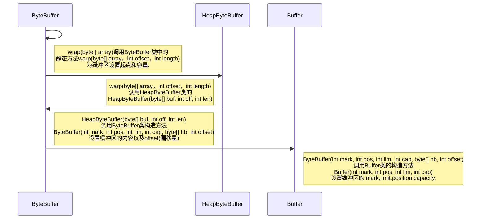

# 系列文章目录

[1.NIO系列之NIO和缓冲区(一)](https://blog.csdn.net/qq_22926739/article/details/105347329)

[2.NIO系列之NIO和缓冲区(二)](https://blog.csdn.net/qq_22926739/article/details/108635107)
<!-- TOC -->
* [系列文章目录](#系列文章目录)
* [序言](#序言)
* [一、Buffer类的相关API](#一buffer类的相关api)
  * [1.1. 静态方法warp()](#11-静态方法warp)
    * [1.1.1. warp()方法的使用](#111-warp方法的使用)
    * [1.1.2. Buffer对象的创建流程](#112-buffer对象的创建流程)
    * [1.1.3. 缓冲区技术原理](#113-缓冲区技术原理)
  * [1.2. 限制(limit)的获取与设置](#12-限制limit的获取与设置)
    * [1.2.1 什么是限制](#121-什么是限制)
      * [1.2.1-a 为什么demo.main A 处capacity=limit=5](#121-a-为什么demomain-a-处capacitylimit5)
      * [1.2.1-b 为什么代码在运行到第38行抛出了IndexOutOfBoundsException](#121-b-为什么代码在运行到第38行抛出了indexoutofboundsexception)
    * [1.2.2 限制(limit)的特点](#122-限制limit的特点)
  * [1.3. 位置(position)的设置与获取](#13-位置position的设置与获取)
    * [1.3.1 什么是位置](#131-什么是位置)
    * [1.3.2 位置(position)的特点](#132-位置position的特点)
  * [1.4. 剩余空间(remaining)的获取](#14-剩余空间remaining的获取)
    * [1.4.1 什么是剩余空间](#141-什么是剩余空间)
  * [1.5. 标记(mark)处理](#15-标记mark处理)
    * [1.5.1 mark的作用](#151-mark的作用)
    * [1.5.2 mark的特点](#152-mark的特点)
* [二、实验](#二实验)
  * [2.1. capacity>=0,limit>=0,position>=0](#21-capacity0limit0position0)
    * [2.1.1 capacity>=0](#211-capacity0)
    * [2.1.2 limit>=0](#212-limit0)
    * [2.1.3 position>=0](#213-position0)
  * [2.2. position<=limit](#22-positionlimit)
  * [2.3. limit<=capacity](#23-limitcapacity)
  * [2.4. 如果定义了mark,那么在将position和limit调整为小于该mark的值时,该mark将被丢弃](#24-如果定义了mark那么在将position和limit调整为小于该mark的值时该mark将被丢弃)
    * [2.4.1 如果定义了mark,那么在将position调整为小于该mark的值时,该mark将被丢弃](#241-如果定义了mark那么在将position调整为小于该mark的值时该mark将被丢弃)
    * [2.4.2  如果定义了mark,那么在将limit调整为小于该mark的值时,该mark将被丢弃](#242--如果定义了mark那么在将limit调整为小于该mark的值时该mark将被丢弃)
  * [2.5. 调用reset()方法时必须定义mark,否则将抛出InvalidMarkException异常](#25-调用reset方法时必须定义mark否则将抛出invalidmarkexception异常)
  * [2.6. limit小于position,那么将position的值设置为新的limit](#26-limit小于position那么将position的值设置为新的limit)
  * [2.7. 测试当limit==position是,操作缓冲区会出现的情况](#27-测试当limitposition是操作缓冲区会出现的情况)
* [三、写在最后](#三写在最后)
<!-- TOC -->
# 序言

上一篇博客中简单的介绍了NIO中的一些知识,由于当时诸事缠身导致博文写到一半就搁置了,显得有些虎头蛇尾的.那么,本次博文接着上一篇篇博文继续往下介绍.在上一篇博文中介绍了==Buffer类==中的两个方法,分别是`int capacity()`和静态方法`warp()`也算是为Buffer类的使用开了个头吧.如果有忘记上篇博文内容的童鞋可以去看一看 [NIO系列之NIO和缓冲区(一)](https://blog.csdn.net/qq_22926739/article/details/105347329)简单的回忆一下.下面闲话少叙,接着上一篇博文往下继续谈一谈**Buffer类**的相关内容.

# 一、Buffer类的相关API

在上一篇博文中我们谈到了缓冲区(Buffer)的7个直接子类和创建缓冲区所使用的静态方法`warp()`.那么,我们先来聊聊这个静态方法`warp()`以及缓冲区创建的流程(以ByteBuffer类为例).

## 1.1. 静态方法warp()

其实这个`warp()`方法我在上一篇博文中就已经聊到了,在这里之所以再拿出来聊一聊是因为由于时间关系上一篇博文中并没有很好的去谈一谈这个`warp()`方法.

### 1.1.1. warp()方法的使用

这个`warp()`方法的使用在上篇博文中已经讲到了,这里就不多说了.直接看代码:

```java
public class demo {
    public static void main(String[] args) {
        byte[] bytes = new byte[]{1,3,5};
        Buffer byteBuffer = ByteBuffer.wrap(bytes);
        System.out.println("byteBuffer="+byteBuffer.getClass().getName());
        System.out.println("容量为："+byteBuffer.capacity());
    }
}
```

运行结果:

```xml
byteBuffer=java.nio.HeapByteBuffer
容量为：3
```

从运行结果来看,我创建了一个容量为3的HeapByteBuffer类型缓冲区.<font color='red'>What? 容量为3好理解,应为bytes数组的长度是3,这个HeapByteBuffer类型是什么鬼?不应该是ByteBuffer类型或者Buffer类型的缓冲区吗?</font>其实我第一次知道这个结果的时候也是一脸懵*的,后来去查看源码后才明白.这里先留个疑问,我们后面去解决它.

### 1.1.2. Buffer对象的创建流程

由于`ByteBuffer ChartBuffer...`等都是抽象类,所以`warp()`就相当于创建这些缓冲区的工厂方法,下面我们去源码中看看这个warp()是怎么创建一个缓冲区的(这里以ByteBuffer类作为示例),创建流程示例如图1.1.2-a所示:


<center>图 1.1.2-a ByteBuffer创建流程</center>

通过源码可以很清楚的看到`warp()`方法的执行过程:



从源码中可以发现ByteBuffer和HeapByteBuffer是父子类关系,所以使用`warp()`创建ByteBuffer缓冲区在本质上就是通过创建HeapByteBuffer类的实例来创建ByteBuffer类的实例,类似于`ByteBuffer buffer = new HeapByteBuffer()`,所以在将HeapByteBuffer类的对象赋值给ByteBuffer类型的变量时产生了多态关系.这也就解释了为什么执行结果会出现`byteBuffer=java.nio.HeapByteBuffer`的原因了.

### 1.1.3. 缓冲区技术原理

从源码中不难看出ByteBuffer类缓冲区的技术原理就是==使用byte[]数组进行数据的保存,后续再使用指定的API来操作这个数组以达到实现缓冲区的目的==.源码如图1.1.3-a所示:


<center>图1.1.3-a HeapByteBuffer类构造方法流程</center>

在HeapByteBuffer类的构造方法中,使用`super(-1, off, off + len, buf.length, buf, 0)`调用父类构造方法将byte[]数组传递给父类ByteBuffer,而且子类HeapByteBuffer还重写了父类中的大部分方法.因此,在调用HeapByteBuffer类的API时,访问的是父类ByteBuffer中的byte[]数组,执行的是HeapByteBuffer类中重写的方法.

相比于byte[]数组,缓冲区的优点就在于缓冲区将存储数据的byte[]数组内容与相关信息进行了封装,这样便于得到相关信息以及处理数据.

## 1.2. 限制(limit)的获取与设置

|           方法名           |       作用        |        返回值         |    参数     |
| :------------------------: | :---------------: | :-------------------: | :---------: |
|        int limit()         | 获取缓冲区的limit |        limit值        |    NULL     |
| Buffer limit(int newLimit) | 设置缓冲区的limit | 设置新的limit的缓冲区 | 新的limit值 |


### 1.2.1 什么是限制

定义:缓冲区的**限制(limit)**表示第一个不应该被读写的元素index(索引).

这样说或许有点不好理解,用一张示意图(图 1.2.1-a)来帮助理解.


<center>图 1.2.1-a limit应用示例</center>

从图 1.2.1-a可以看出:

> 1. 该缓冲区有10个位置可以存放数据,但是允许访问的只有4个位置,而index≥4是无法访问的.
>
> 2. limit的值不能大于该缓冲区的capacity(容量),否则将抛出IndexOutOfBoundsException.

因此,在JDK API Doc中对limit的解释为:第一个不应该被访问(读/写)的元素的index.下面用代码来验证一下:

```java
public class demo {
    public static void main(String[] args) {
        char[] bytes = new char[]{'1','2','3','4','5'};
        CharBuffer buffer = CharBuffer.wrap(bytes);
        System.out.println("demo.main A capacity="+buffer.capacity()+", limit="+buffer.limit());
        buffer.limit(3);
        System.out.println("demo.main B capacity="+buffer.capacity()+", limit="+buffer.limit());
        buffer.put(0,'6');
        buffer.put(1,'7');
        buffer.put(2,'8');
        buffer.put(3,'9');
        buffer.put(4,'0');
    }
}
```

运行结果如图 1.2.1-b所示:


<center>图 1.2.1-b 运行结果</center>

> 从运行结果可以看出两个问题:
>
> 1. demo.main A 处capacity=limit=5,这是为什么 ?
> 2. 为什么代码在运行到第38行抛出了IndexOutOfBoundsException ?

下面我们来一个一个解决问题,先看第一个问题:

#### 1.2.1-a 为什么demo.main A 处capacity=limit=5

如果,在这里我直接用语言描述这个问题的原因会有些晦涩,所以我画了一个图用来展示第一次存储数据即:`CharBuffer buffer = CharBuffer.wrap(bytes)`,如图 1.2.1-c所示:


<center>图 1.2.1-c 第一次存储数据</center>

第一次存入数据用的是`warp()`方法,并没有主动设置limit,那么我们做个假设:

> 1. 缓冲区在初始化时limit的值==缓冲区最右边数据所对应的index(index=4),即图 1.2.1-c中的limit1所对应的位置,再结合limit的定义会发现我们无法操作整个缓冲区,所以图中limit1对标示的位置并不是正确的**限制**所在的位置.
> 2. 缓冲区在初始化时limit的值==缓冲区capacity+1所对应的index(index=5,蓝色部分在缓冲区中实际不存在),即图 1.2.1-c中的limit所对应的位置,再结合limit的定义发现显然是合理的,所以图中limit标示的位置是该缓冲区**限制**的实际位置.

所以说,在调用`warp()`方法后limit的值=capacity+1所对应的index,但是由于limit的值是从0开始,而capacity的值是从1开始,因此这里不能简单的认为调用`warp()`方法后~limit==capacity~.

#### 1.2.1-b 为什么代码在运行到第38行抛出了IndexOutOfBoundsException


<center>图 1.2.1-d 代码执行示意图</center>

从图中我们可以看到:

> 1. 首先执行`warp()`方法初始化了一个capacity=5的缓冲区
> 2. 在index=3 的位置设置limit,即执行了`buffer.limit(3)`
> 3. 对缓冲区进行重新写入数据,执行`put()`方法

先看下`put()`方法的源码:

```java
    public CharBuffer put(int i, char x) {
        hb[ix(checkIndex(i))] = x;
        return this;
    }
```

从`put()`源码可以看出来在执行put方法时先读取缓冲区中对应位置的数据再通过赋值对数据进行覆盖重写.因此可以看出`IndexOutOfBoundsException`这个异常是在读取时抛出的,抛出的原因也很简单其实就是执行了``buffer.limit(3)``所以从index=3开始的数据不能被读写,而demo中执行了`buffer.put(3,'9')`从而导致了异常的抛出.

### 1.2.2 限制(limit)的特点

- 缓冲区的限制(limit)不能为负.
- limit不能大于capacity.
- 如果limit大于position,那么将position的值设置为新的limit.
- 如果mark已定义且大于limit,则丢弃改mark.

我知道看到这里大家会对position和mark产生兴趣.Don't worry !这两个后面我会一一介绍,并且在缓冲区系列结束之前也会做一些实验来加深对这些的理解.现在先记住limit的相关知识即可.

## 1.3. 位置(position)的设置与获取

|              方法名              |         作用         | 返回值 | 参数 |
| :------------------------------: | :------------------: | :----: | :--: |
|          int position()          | 获取缓冲区的position |  int   | NULL |
| Buffer position(int newPosition) | 设置缓冲区的position | Buffer | int  |

### 1.3.1 什么是位置

- 定义: 表示Next.即下一个要被读/写的元素index(索引).

还和上面一样,我们先看下position示意图,然后再看一个demo来加深一下理解,position应用示例如图1.3.1-a 所示:


<center>图 1.3.1-a position应用示例</center>

从上面的图中可以看出position对应的index=3,说明从index=3的位置处开始读/写数据知道limit结束.下面用一个demo来验证position是下一个读/写的index:

```java
public class Demo {
    public static void main(String[] args) {
        char[] chars = new char[]{'A','B','C','D','E','F','G','H','I'};
        CharBuffer buffer = CharBuffer.wrap(chars);
        System.out.println("demo.main A capacity="+buffer.capacity()+", limit="+buffer.limit()+", position="+buffer.position());
        buffer.position(4);
        System.out.println("demo.main B capacity="+buffer.capacity()+", limit="+buffer.limit()+", position="+buffer.position());
        buffer.put("1");
        buffer.put("2");
        buffer.put("3");
        buffer.put("4");
        buffer.put("5");
        // 查看数据
        for (char c : chars) {
            System.out.print(c+"--");
        }
        System.out.println();
        buffer.limit(3);
        System.out.println("demo.main C capacity="+buffer.capacity()+", limit="+buffer.limit()+", position="+buffer.position());
    }
}
```

程序运行结果如图 1.3.1-b 所示:


<center>图 1.3.1-b 程序运行结果</center>

对应图中的序号来解读一下执行结果:

- ①其实没啥好讲的就是调用`warp()`对缓冲区进行初始化.此时可以看到limit=9,position=0;
- ②首先是设置了position=4,然后调用`put()`方法进行数据写入,然后可以直观的看到position是下一个读/写的index(position=4,第一个数据从index=4的位置写入)
- ③其实这个是为了填讲解limit是留下的坑:`如果limit小于position,那么将position的值设置为新的limit.`

### 1.3.2 位置(position)的特点

JDK官方文档对position的描述中有这么一句话:*If the mark is defined and larger than the new position then it is discarded.Must be non-negative and no larger than the current limit.* 翻译过来就是:*如果标记已定义且大于新位置,则丢弃该标记.必须是非负的并且不大于当前的限制.*由此可见position的特点:

- 0<=position<=limit(虽然说当position>limit时limit会被赋值为position的值,但是这样无意义因为你依然无法操作缓冲区);
- 如果标记(mark)已定义且大于新位置,则丢弃该标记(mark).

## 1.4. 剩余空间(remaining)的获取

|     方法名      |         作用          | 返回值 | 参数 |
| :-------------: | :-------------------: | :----: | :--: |
| int remaining() | 获取缓冲区的remaining |  int   | NULL |

可能看到剩余空间四个字大家第一时间想到的是缓冲区还剩余多少空间未被使用.其实不然,这里的剩余空间指的不是这个,那是什么呢?

### 1.4.1 什么是剩余空间

**定义:** 是指当前位置(position)与限制(limit)之间的元素数,即:`remaining()=limit() - position()`.其实我个人觉得这里叫剩余空间并不是十分合适,毕竟容易让别人产生误解.

下面我们看下remaining的应用示例图,然后再去写个demo来感受下remaining.先看下应用示例,如图 1.4.1-a 所示:


<center>图 1.4.1-a remaining的应用示例</center>

可能有的童鞋会想,你是怎么知道remaining=limit-position的?其实吧,我一开始也不知道,包括一开始对剩余空间的理解也认为是缓冲区未被使用的空间,直到我看了源码(如 图1.4.1-b)才理解了remaining.


<center>图 1.4.1-b remaining() 源码</center>

从上面的图片可以看出来remaining=limit-position并不是我臆测的,并且Javadoc上的注释有这么一句话:Returns the number of elements between the current position and the limit.这句话也印证了我的说法.

OK~ 说了这么多,接下来我们来写个demo来实际的体验一下这个remaining吧!

```java
public class Demo {
    public static void main(String[] args) {
        char[] chars = new char[]{'A','B','C','D','E','F','G','H','I'};
        CharBuffer buffer = CharBuffer.wrap(chars);
        System.out.println("demo.main A capacity="+buffer.capacity()+", limit="+buffer.limit()+", position="+buffer.position()+", remaining="+buffer.remaining());
        buffer.position(4);
        System.out.println("demo.main B capacity="+buffer.capacity()+", limit="+buffer.limit()+", position="+buffer.position()+", remaining="+buffer.remaining());
        buffer.limit(7);
        System.out.println("demo.main C capacity="+buffer.capacity()+", limit="+buffer.limit()+", position="+buffer.position()+", remaining="+buffer.remaining());
        buffer.limit(3);
        System.out.println("demo.main D capacity="+buffer.capacity()+", limit="+buffer.limit()+", position="+buffer.position()+", remaining="+buffer.remaining());
    }
}
```

代码的运行结果如下图:


<center>图 1.4.1-c 运行结果</center>

## 1.5. 标记(mark)处理

|    方法名     |           作用           | 返回值 | 参数 |
| :-----------: | :----------------------: | :----: | :--: |
| Buffer mark() | 在此缓冲区的位置设置标记 | Buffer | NULL |

### 1.5.1 mark的作用

缓冲区的标记(mark)是一个索引,在调用`reset()`方法时会将缓冲区的position重置到该mark所标记的位置.

缓冲区中的mark就像是公路上的路标,目的就是在原路返回时找到回去的路.这里我们用一个demo来体验一下.

```java
public class Demo {
    public static void main(String[] args) {
        char[] chars = new char[]{'A','B','C','D','E','F','G','H','I'};
        CharBuffer buffer = CharBuffer.wrap(chars);
        System.out.println();
        System.out.println("demo.main A capacity="+buffer.capacity()+", limit="+buffer.limit()+", position="+buffer.position()+"\n");
        // 在index=2的位置设置mark
        buffer.position(2);
        buffer.mark();
        System.out.println("demo.main B capacity="+buffer.capacity()+", limit="+buffer.limit()+", position="+buffer.position()+"\n");
        // 改变position的位置
        buffer.position(7);
        System.out.println("demo.main C capacity="+buffer.capacity()+", limit="+buffer.limit()+", position="+buffer.position()+"\n");
        // 重置缓冲区
        buffer.reset();
        System.out.println("demo.main D capacity="+buffer.capacity()+", limit="+buffer.limit()+", position="+buffer.position()+"\n");
    }
}
```

运行结果如下图所示:


<center>图 1.5.1-a 运行结果</center>

从上面的运行结果可以看出来当执行了`buffer.reset()`缓冲区的position的确是回到了index=2的位置.

### 1.5.2 mark的特点

在jdk文档上有这么一段描述:***A buffer's mark is the index to which its position will be reset when the reset method is invoked. The mark is not always defined, but when it is defined it is never negative and is never greater than the position. If the mark is defined then it is discarded when the position or the limit is adjusted to a value smaller than the mark. If the mark is not defined then invoking the reset method causes an InvalidMarkException to be thrown.*** 这段描述是引用自jdk官方文档中的具体位置可以[点击这里](https://docs.oracle.com/javase/8/docs/api/index.html)去查看**Marking and resetting**.这段话翻译过来的意思就是==缓冲区的标记是在调用reset方法时将其位置重置到的索引.标记并不总是被定义的,但当它被定义时,它永远不会是负的，也永远不会大于位置.如果标记已定义,则在将位置或限制调整为小于标记的值时将丢弃标记.如果未定义标记,则调用reset方法将导致抛出InvalidMarkException==.

由此可见mark有以下几个特点:

- 0<=mark<=position;
- 如果定义了mark,那么在将position和limit调整为小于该mark的值时,该mark将被丢弃,丢弃后的mark值为-1;
- mark并不是必须被定义的,但是在调用`reset()`方法时必须定义mark,否则将抛出`InvalidMarkException`异常;

# 二、实验

在本系列的第一篇博文和本篇博文介绍了缓冲区的4个核心技术:capacity、limit、position、mark, 根据这4个技术点的特征我们进行下面7个实验(有一些在前面介绍技术点的时候也写过):

1. capacity>=0,limit>=0,position>=0;
2. position<=limit;
3. limit<=capacity;
4. 如果定义了mark,那么在将position和limit调整为小于该mark的值时,该mark将被丢弃;
5. 调用`reset()`方法时必须定义mark,否则将抛出`InvalidMarkException`异常;
6. limit小于position,那么将position的值设置为新的limit;
7. 测试当limit==position是,操作缓冲区会出现的情况;

下面我们具体来看看这7个实验.

## 2.1. capacity>=0,limit>=0,position>=0


###  2.1.1 capacity>=0

在测试capacity>=0之前,先简单介绍`allocate()`方法,这个方法可以帮助我们开辟出指定大小的缓冲区.下面我们直接看代码:

```java
public class Demo {
    public static void main(String[] args) {
        int[] capacity = new int[]{-1,0,1};
        for (int i = 0; i < capacity.length; i++) {
            try {
                CharBuffer charBuffer = CharBuffer.allocate(capacity[i]);
                System.out.println("capacity=" + charBuffer.capacity()+",此时capacity数组的值为"+capacity[i]+",i="+i);
            } catch (IllegalArgumentException e) {
                System.err.println("charBuffer的容量(capacity)不能为负数!,此时capacity数组的值为"+capacity[i]+",i="+i);
            }
        }
    }
}
```

运行结果如下图:


### 2.1.2 limit>=0

下面我们来验证一下limit>=0:

```java
public class Demo {
    public static void main(String[] args) {
        char[] chars = new char[]{'A','B','C','D','E','F','G','H','I'};
        CharBuffer buffer = CharBuffer.wrap(chars);
        int[] limit = new int[]{-1,0,1};
        for (int i = 0; i < limit.length; i++) {
            try {
                CharBuffer charBuffer = CharBuffer.allocate(limit[i]);
                System.out.println("limit=" + charBuffer.limit()+",此时limit数组的值为"+limit[i]+",i="+i);
            } catch (IllegalArgumentException e) {
                System.err.println("charBuffer的limit不能为负数!,此时limit数组的值为"+limit[i]+",i="+i);
            }
        }
    }
}
```

运行结果如下:


### 2.1.3 position>=0

下面我们来验证一下position>=0:

```java
public class Demo {
    public static void main(String[] args) {
        char[] chars = new char[]{'A','B','C','D','E','F','G','H','I'};
        CharBuffer buffer = CharBuffer.wrap(chars);
        int[] position = new int[]{-1,0,1};
        for (int i = 0; i < position.length; i++) {
            try {
                CharBuffer charBuffer = CharBuffer.allocate(position[i]);
                System.out.println("position=" + charBuffer.position()+",此时position数组的值为"+position[i]+",i="+i);
            } catch (IllegalArgumentException e) {
                System.err.println("charBuffer的position不能为负数!,此时position数组的值为"+position[i]+",i="+i);
            }
        }
    }
}
```

运行结果如下:


## 2.2. position<=limit

下面我们来验证position<=limit:

```java
public class Demo {
    public static void main(String[] args) {
        char[] chars = new char[]{'A','B','C','D','E','F','G','H','I'};
        CharBuffer buffer = CharBuffer.wrap(chars);
        buffer.limit(4);
        int[] position = new int[]{3,4,5};
        for (int i = 0; i < position.length; i++) {
            try {
                buffer.position(position[i]);
                System.out.println("position=" + buffer.position()+",limit="+buffer.limit()+",此时position数组的值为"+position[i]+",i="+i);
            } catch (IllegalArgumentException e) {
                System.err.println("charBuffer的position不能大于limit! limit="+buffer.limit()+",此时position数组的值为"+position[i]+",i="+i);
            }
        }
    }
}
```

运行结果如下:


## 2.3. limit<=capacity

下面来验证limit<=capacity:

```java
public class Demo {
    public static void main(String[] args) {
        char[] chars = new char[]{'A','B','C','D','E','F','G','H','I'};
        CharBuffer buffer = CharBuffer.wrap(chars);
        int[] limit = new int[]{8,9,10};
        for (int i = 0; i < limit.length; i++) {
            try {
                buffer.limit(limit[i]);
                System.out.println("limit=" + buffer.limit()+",limit="+buffer.limit()+",此时limit数组的值为"+limit[i]+",i="+i);
            } catch (IllegalArgumentException e) {
                System.err.println("charBuffer的limit不能大于capacity! limit="+buffer.limit()+",此时limit数组的值为"+limit[i]+",i="+i);
            }
        }
    }
}
```

运行结果如下:


## 2.4. 如果定义了mark,那么在将position和limit调整为小于该mark的值时,该mark将被丢弃

在验证这一点时,我们要将这一点拆分成2点来验证,分别是:

1. 如果定义了mark,那么在将position调整为小于该mark的值时,该mark将被丢弃;
2. 如果定义了mark,那么在将limit调整为小于该mark的值时,该mark将被丢弃;


### 2.4.1 如果定义了mark,那么在将position调整为小于该mark的值时,该mark将被丢弃

```java
public class Demo {
    public static void main(String[] args) {
        char[] chars = new char[]{'A','B','C','D','E','F','G','H','I'};
        CharBuffer buffer = CharBuffer.wrap(chars);
        buffer.position(5);
        buffer.mark();
        int[] position = new int[]{7,4};
        for (int i : position) {
            System.out.println("在5的位置设置了mark!");
            System.out.println("新的position="+i);
            setPosition(buffer,i);
            System.out.println("----------");
        }
    }
    public static void setPosition(CharBuffer charBuffer,int position){
        charBuffer.position(position);
        try {
            charBuffer.reset();
            System.out.println("CharBuffer 回到"+charBuffer.position()+"位置!");
        }catch (InvalidMarkException e){
            System.err.println("该mark标记无效!");
        }
    }
}
```

运行结果如下:


### 2.4.2  如果定义了mark,那么在将limit调整为小于该mark的值时,该mark将被丢弃

```java
public class Demo {
    public static void main(String[] args) {
        char[] chars = new char[]{'A','B','C','D','E','F','G','H','I'};
        CharBuffer buffer = CharBuffer.wrap(chars);
        buffer.position(5);
        buffer.mark();
        int[] limit = new int[]{7,4};
        for (int i : limit) {
            System.out.println("在5的位置设置了mark!");
            System.out.println("新的limit="+i);
            setLimit(buffer,i);
            System.out.println("----------");
        }
    }
    public static void setLimit(CharBuffer charBuffer,int limit){
        charBuffer.limit(limit);
        try {
            charBuffer.reset();
            System.out.println("CharBuffer 回到"+charBuffer.position()+"位置!");
        }catch (InvalidMarkException e){
            System.err.println("该mark标记无效!");
        }
    }
}
```

运行结果如下:


## 2.5. 调用reset()方法时必须定义mark,否则将抛出InvalidMarkException异常

```java
public class Demo {
    public static void main(String[] args) {
        char[] chars = new char[]{'A','B','C','D','E','F','G','H','I'};
        CharBuffer buffer = CharBuffer.wrap(chars);
        CharBuffer buffer2 = CharBuffer.wrap(chars);
        buffer.position(5);
        buffer.mark();
        buffer2.position(5);
        try {
            buffer.reset();
            System.out.println("buffer 回到"+buffer.position()+"位置!");
        }catch (InvalidMarkException e){
            System.err.println("buffer 的mark标记无效!");
        }
        try {
            buffer2.reset();
            System.out.println("buffer2 回到"+buffer2.position()+"位置!");
        }catch (InvalidMarkException e){
            System.err.println("buffer2 的mark标记无效!");
        }
    }
}
```

运行结果如下:


## 2.6. limit小于position,那么将position的值设置为新的limit

```java
public class Demo {
    public static void main(String[] args) {
        char[] chars = new char[]{'A','B','C','D','E','F','G','H','I'};
        CharBuffer buffer = CharBuffer.wrap(chars);
        buffer.position(5);
        int[] limit = new int[]{6,5,4};
        for (int i : limit) {
            System.out.println();
            System.out.println("新的limit= "+i);
            buffer.limit(i);
            System.out.println("capacity="+buffer.capacity()+", position="+buffer.position()+", limit="+buffer.limit());
            System.out.println("----------");
        }
    }
}
```

运行结果如下:


## 2.7. 测试当limit==position是,操作缓冲区会出现的情况

```java
public class Demo {
    public static void main(String[] args) {
        char[] chars = new char[]{'A','B','C','D','E','F','G','H','I'};
        CharBuffer buffer = CharBuffer.wrap(chars);
        buffer.position(5);
        buffer.limit(5);
        System.out.println("capacity="+buffer.capacity()+", position="+buffer.position()+", limit="+buffer.limit());
        buffer.put("X");
    }
}
```

运行结果如下:


上图可以清楚的看到,当limit和position的值一样时,在指定的position位置写入数据是会出现`BufferOverflowException`异常,因为该位置是被限制的.

# 三、写在最后

这篇博客是NIO系列的第二篇,一直是断断续续的写的,所以中间可能会有些不连贯、措辞不准确等等的,还请童鞋们指出来.同时我也在构思下一篇博文,希望我后面的博文会越来越好.
