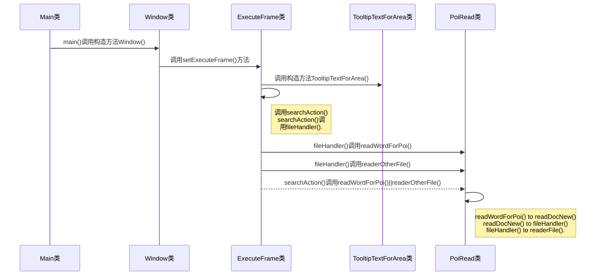

<!-- TOC -->
* [一.前言](#一前言)
  * [1.写在前面](#1写在前面)
  * [2.实现目标及效果图](#2实现目标及效果图)
    * [A.实现目标](#a实现目标)
    * [B.效果图](#b效果图)
* [二.Swing框架和POI介绍](#二swing框架和poi介绍)
  * [1.Swing框架介绍](#1swing框架介绍)
    * [1.什么是Swing？](#1什么是swing)
    * [2.Swing中的容器介绍](#2swing中的容器介绍)
    * [3.一些容器与按钮的写法](#3一些容器与按钮的写法)
  * [2.POI介绍](#2poi介绍)
    * [1.什么是POI](#1什么是poi)
    * [2.基本功能](#2基本功能)
    * [3.基本用法（Word&Excel）](#3基本用法wordexcel)
      * [1.操作Excel文档](#1操作excel文档)
      * [2.操作Word文档](#2操作word文档)
* [三.文本适配器开发](#三文本适配器开发)
  * [1.画窗口](#1画窗口)
  * [2.写监听方法](#2写监听方法)
  * [3.处理文件](#3处理文件)
* [四.依赖打入jar包](#四依赖打入jar包)
  * [1. 打包前的准备工作](#1-打包前的准备工作)
    * [1. 配置pom.xml](#1-配置pomxml)
    * [2. 在项目文件夹下新建assembly/release.xml文件](#2-在项目文件夹下新建assemblyreleasexml文件)
  * [2. 使用==mvn package assembly:single==命令进行打包](#2-使用mvn-package-assemblysingle命令进行打包)
    * [1. 进入项目文件夹下](#1-进入项目文件夹下)
    * [2.执行mvn package assembly:single命令](#2执行mvn-package-assemblysingle命令)
    * [3.检查项目下的target文件夹](#3检查项目下的target文件夹)
* [五.jar包处理成可执行文件(.exe文件)](#五jar包处理成可执行文件exe文件)
  * [1.准备工作](#1准备工作)
  * [2.将jar包处理成可执行文件](#2将jar包处理成可执行文件)
* [六.结束语](#六结束语)
<!-- TOC -->TOC](记一次糟糕的开发经历[文本匹配器]--swing框架使用)

# 一.前言
## 1.写在前面
&#8195; &#8195; 笔者最近因为公司里的一些~~开心事(糟心事还差不多)~~裸辞在家，一方面想换个工作环境。换换心情.另一方面也想找段时间好好沉淀一下自己。因此步入了失业人群，没事的时候在家看看书撸撸代码过得也还行。今天在整理自己工作笔记的时候发现找代码段真的好麻烦，每次都要打开文件一点一点看，因此就萌生了一个想法就是自己写一个文本匹配器。
&#8195; &#8195; 为什么说是糟糕的开发经历呢？一方面是因为工作，当然这不是重要的事情。最重要的是因为长时间从事web开发Swing框架几乎已经忘完了，所以才造就了这次磕磕绊绊的糟糕开发经历。
## 2.实现目标及效果图
### A.实现目标
**实现目标：** 给定一段文本，选择若干个文件，点击搜索显示文件信息和搜索结果。
### B.效果图
&#8195; &#8195; 由于是笔者为了方便自己偷懒而开发的软件，所以界面并不好看，刚好我对这些地方也并不怎么在意，所以就凑合着用吧。界面效果图如1.2.1所示，运行效果图如1.2.2和1.2.3所示。


<center>图1.2.1</cenetr>
  
</center>


<center>图1.2.2</cenetr>
  
</center>


<center>图1.2.3</cenetr>


&#8195; &#8195; 看完了这些吐槽的话，下面开始我们的开发之旅。当然在开发之前首先要了解一些知识点。这次的开发主要涉及以下知识：

知识点     | 作用
-------- | -----
Swing框架  | 用于搭建项目界面
POI  | 用来操作Word、Excel等文档当然这里只涉及读取
File类  | 用于操作文件
IO流  | 用来对文档内容进行读写，比如BufferWriter、BufferReader等

# 二.Swing框架和POI介绍
## 1.Swing框架介绍
### 1.什么是Swing？
&#8195; &#8195; Swing是一个用于开发Java应用程序用户界面的开发工具包。它以抽象窗口工具包（AWT）为基础使跨平台应用程序可以使用任何可插拔的外观风格。Swing开发人员只用很少的代码就可以利用Swing丰富、灵活的功能和模块化组件来创建优雅的用户界面。
&#8195; &#8195; Swing 围绕 JComponent 组件构建，JComponent 则由 AWT 的容器类扩展而来。Swing 组织结构如图 2.1.1 所示。

<center>图 2.1.1</cenetr>

### 2.Swing中的容器介绍
&#8195; &#8195;Swing 中容器可以分为两类：顶层容器和中间容器。
- 顶层容器
&#8195; &#8195;顶层容器是进行图形编程的基础，一切图形化的东西都必须包括在顶层容器中。顶层容器是任何图形界面程序都要涉及的主窗口，是显示并承载组件的容器组件。

| 种类     | 介绍|
|:--------:| :----- |
| JFrame  | 用于框架窗口的类，此窗口带有边框、标题、关闭和最小化窗口的图标。带 GUI 的应用程序至少使用一个框架窗口 |
| JDialog  | 用于对话框的类，主要用于弹出各种对话框 |
| JApplet  | 用于使用 Swing 组件的 Java Applet 类，主要用于在浏览器内显示一个小程序界面 |


- 中间容器
&#8195; &#8195;中间容器是容器组件的一种，也可以承载其他组件，但中间容器不能独立显示，必须依附于其他的顶层容器。

| 种类     | 介绍|
|:--------:| :----- |
| JPanel  | 表示一个普通面板，是最灵活、最常用的中间容器 |
| JScrollPane  | 与 JPanel 类似，但它可在大的组件或可扩展组件周围提供滚动条 |
| JTabbedPane  | 表示选项卡面板，可以包含多个组件，但一次只显示一个组件，用户可在组件之间方便地切换 |
| JToolBar  | 表示工具栏，按行或列排列一组组件（通常是按钮） |
### 3.一些容器与按钮的写法
&#8195; &#8195;在这个项目中用到的顶层容器：==JFrame==、==JDialog==，中间容器有==JPanel==、==JScrollPane==、==JTabbedPane==，下面简单看下这几个容器的用法：

```java
		// 创建顶层容器 JFrame
		JFrame frame = new JFrame("文本匹配器");
        // 设置窗口不可自由变换大小
        frame.setResizable(false);
        // 设置窗口大小
        frame.setSize(600,500);
        // 设置窗口相对于指定组件的位置--null表示窗口位于屏幕中央
        frame.setLocationRelativeTo(null);
        // 设置窗口左上角图标（默认是Java的咖啡图标）
        ImageIcon imageIcon = new ImageIcon("src/main/java/matching.jpg");
        frame.setIconImage(imageIcon.getImage());
        // 窗口关闭按钮
        frame.setDefaultCloseOperation(WindowConstants.EXIT_ON_CLOSE);
        // 设置窗口、控件可见性
        frame.setVisible(true);
        //效果图如图2.1.2所示
```

<center>图 2.1.2</cenetr>

```java
		// 创建对话框 JDialog
		//初始化文件选择框
        JFileChooser fDialog = new JFileChooser();
        //设置文件选择框的标题
        fDialog.setDialogTitle("请选择文件");
        //设置文件多选
        fDialog.setMultiSelectionEnabled(true);
        //弹出选择框
        int returnVal = fDialog.showOpenDialog(null);
        //效果图如图2.1.3所示
```

<center>图 2.1.3</cenetr>

```java
		// 创建普通面板 JPanel  
		//创建一个JFrame对象
		JFrame jf=new JFrame("Java第二个GUI程序");   
		//设置窗口大小和位置 
        jf.setBounds(300, 100, 400, 200);    
        //创建一个JPanel对象
        JPanel jp=new JPanel();    
        //创建一个标签
        JLabel jl=new JLabel("这是放在JPanel上的标签");    
        //设置背景色
        jp.setBackground(Color.white);    
        //将标签添加到面板
        jp.add(jl);    
        //将面板添加到窗口
        jf.add(jp);    
        //设置窗口可见
        jf.setVisible(true);  
        //效果图如图2.1.4所示
```

<center>图 2.1.4</cenetr>

```java
		// 创建可滚动面板
		// 创建文本域（图中亮白色部分）
		JTextArea target = new JTextArea(10,50);
		// 初始化可滚动面板
        JScrollPane scrollPane_top=new JScrollPane();
        // 将文本域添加到可滚动面板中
        scrollPane_top.setViewportView(target);
		//效果图如图2.1.5所示（被黑色矩形选中的部分）
```

<center>图 2.1.5</cenetr>

```java
		// 创建选项卡面板
		// 创建文本域
		JTextArea target = new JTextArea(10,50);
		// 初始化选项卡面板
        JTabbedPane tabbedPane_top = new JTabbedPane();
        // 初始化可滚动面板
        JScrollPane scrollPane_top=new JScrollPane();
        // 将可滚动面板添加到选项卡面板中
        tabbedPane_top.addTab("目标文本",null,scrollPane_top,null);
        // 将文本域添加到可滚动面板中
        scrollPane_top.setViewportView(target);
        // 从这里可以看出中间层容器可以承载其他组件（中间层容器也是组件，即容器组件）
		//效果图如图2.1.6所示（被红色矩形选中的部分）
```

<center>图 2.1.6</cenetr>

3. Swing中的控件介绍
&#8195; &#8195;常用的控件有按钮，文本域，文本框，单选框，复选框等等。每个控件可以添加相应的监听事件（对比HTML页面）对以一些操作（如：点击，得到焦点，失去焦点等）进行响应，这里以按钮（JButton）为例介绍其创建及绑定事件。

```java
		// 创建一个右对齐布局的普通面板
		JPanel panel = new JPanel(new FlowLayout(FlowLayout.RIGHT));
		// 创建一个叫“选择文件”的按钮
		JButton chooseFile = new JButton("选择文件");
		// 为按钮添加事件监听
        chooseFile.addActionListener(new ActionListener() {
        	// 当按钮被点击是执行chooseFile()方法
            @Override
            public void actionPerformed(ActionEvent e) {
                chooseFile(addressArea);
            }
        });
        // 将按钮添加到普通面板是
        panel.add(chooseFile,BorderLayout.NORTH);
```
当然，这里只是举个栗子，并不代表按钮只有点击事件。其他的一些事件在项目中用到就会讲解，如果没用到并且你真的想知道的话，建议点击[xietansheng的博客](https://blog.csdn.net/xietansheng/article/details/72814531)(==博主真的很走心==)或者点击[C语言中文网](http://c.biancheng.net/view/1206.html)来学习更多的Swing相关知识。
## 2.POI介绍
### 1.什么是POI
&#8195; &#8195;POI全称是==Apache POI==([点击查看官方文档](https://tool.oschina.net/apidocs/apidoc?api=apache-POI))或==Java POI==。是Apache基金会的开源函式库，POI提供API给Java程序对Microsoft Office格式档案读和写的功能。
### 2.基本功能
- POIFS  : 此组件是所有其他POI元件的基本因素。它被用来明确地读取不同的文件。
- HSSF  : 它被用来读取和写入MS-Excel的xls扩展名的文件。
- XSSF : 它是用于MS-Excel的xlsx扩展名的文件。
- HPSF  : 它用来提取MS-Office文件属性设置。
- HWPF  : 它是用来读取和写入MS-Word的doc扩展名的文件。
- XWPF  : 它是用来读取和写入MS-Word的docx扩展名的文件。
- HSLF  : 它是用于读取，创建和编辑PowerPoint演示文稿。
- HDGF : 它包含类和方法为MS-Visio的二进制文件。
- HPBF : 它被用来读取和写入MS-Publisher文件。

### 3.基本用法（Word&Excel）
#### 1.操作Excel文档
&#8195; &#8195;*这部分代码摘抄自百度百科[POI （Apache POI）](https://baike.baidu.com/item/POI/8886826)，代码很简单，跑一遍就能弄懂。*
1. 创建Excel文档

```java
import org.apache.poi.hssf.usermodel.HSSFWorkbook;
import org.apache.poi.hssf.usermodel.HSSFSheet;
import org.apache.poi.hssf.usermodel.HSSFRow;
import org.apache.poi.hssf.usermodel.HSSFCell;
import java.io.FileOutputStream;
public class CreateXL {
    /** Excel 文件要存放的位置，假定在D盘下*/
    public static String outputFile = "D:\\test.xls";
    public static void main(String argv[]) {
        try {
            // 创建新的Excel 工作簿
            HSSFWorkbook workbook = new HSSFWorkbook();
            // 在Excel工作簿中建一工作表，其名为缺省值
            // 如要新建一名为"效益指标"的工作表，其语句为：
            // HSSFSheet sheet = workbook.createSheet("效益指标");
            HSSFSheet sheet = workbook.createSheet();
            // 在索引0的位置创建行（最顶端的行）
            HSSFRow row = sheet.createRow((short)0);
            //在索引0的位置创建单元格（左上端）
            HSSFCell cell = row.createCell((short)0);
            // 定义单元格为字符串类型
            cell.setCellType(HSSFCell.CELL_TYPE_STRING);//已过时
            // 在单元格中输入一些内容
            cell.setCellValue("增加值");
            // 新建一输出文件流
            FileOutputStream fOut = new FileOutputStream(outputFile);
            // 把相应的Excel 工作簿存盘
            workbook.write(fOut);
            fOut.flush();
            // 操作结束，关闭文件
            fOut.close();
            System.out.println("文件生成...");
        } catch (Exception e) {
            System.out.println("已运行 xlCreate() : " + e);
        }
    }
}
```

2. 读取Excel文档

```java
import org.apache.poi.hssf.usermodel.HSSFWorkbook;
import org.apache.poi.hssf.usermodel.HSSFSheet;
import org.apache.poi.hssf.usermodel.HSSFRow;
import org.apache.poi.hssf.usermodel.HSSFCell;
import java.io.FileInputStream;
public class ReadXL {
    /** Excel文件的存放位置。注意是反斜线*/
    public static String fileToBeRead = "D:\\test1.xls";
    public static void main(String argv[]) {
        try {
            // 创建对Excel工作簿文件的引用
            HSSFWorkbook workbook = new HSSFWorkbook(new FileInputStream(fileToBeRead));
            // 创建对工作表的引用。
            // 本例是按名引用（让我们假定那张表有着缺省名"Sheet1"）
            HSSFSheet sheet = workbook.getSheet("Sheet1");
            // 也可用getSheetAt(int index)按索引引用，
            // 在Excel文档中，第一张工作表的缺省索引是0，
            // 其语句为：HSSFSheet sheet = workbook.getSheetAt(0);
            // 读取左上端单元
            HSSFRow row = sheet.getRow(0);
            HSSFCell cell = row.getCell((short)0);
            // 输出单元内容，cell.getStringCellValue()就是取所在单元的值
            System.out.println("左上端单元是： " + cell.getStringCellValue());
        } catch (Exception e) {
            System.out.println("已运行xlRead() : " + e);
        }
    }
}
```
#### 2.操作Word文档
1. 创建Word文档

```java
		// 创建Word文件
		XWPFDocument doc = new XWPFDocument();
		// 新建一个段落
		XWPFParagraph p = doc.createParagraph();
		// 设置段落的对齐方式
		p.setAlignment(ParagraphAlignment.CENTER);
		//设置下边框
		p.setBorderBottom(Borders.DOUBLE);
		//设置上边框
		p.setBorderTop(Borders.DOUBLE);
		//设置右边框
		p.setBorderRight(Borders.DOUBLE);
		//设置左边框
		p.setBorderLeft(Borders.DOUBLE);
		//创建段落文本
		XWPFRun r = p.createRun();
		r.setText("POI创建的Word段落文本");
		//设置为粗体
		r.setBold(true);
		//设置颜色
		r.setColor("FF0000");
		// 新建一个段落
		p = doc.createParagraph();
		r = p.createRun();
		r.setText("POI读写Excel功能强大、操作简单。");
		//创建一个表格
		XWPFTable table= doc.createTable(3, 3);
		table.getRow(0).getCell(0).setText("表格1");
		table.getRow(1).getCell(1).setText("表格2");
		table.getRow(2).getCell(2).setText("表格3");
		FileOutputStream out = newFileOutputStream("d:\\POI\\sample.doc");
		doc.write(out);
		out.close();
		// 效果图如图2.2.1所示
```

<center>图 2.2.1</cenetr>

2. 读取Word文档
&#8195; &#8195;代码很简单，一看就懂，这里就不放效果图了

```java
		FileInputStream stream = newFileInputStream("d:\\POI\\sample.doc");
		// 创建Word文件
		XWPFDocument doc = new XWPFDocument(stream);
		//遍历段落
		for(XWPFParagraph p : doc.getParagraphs()){
			// 获取每段的文字
			System.out.print(p.getParagraphText());
		}
		//遍历表格
		for(XWPFTable table : doc.getTables()){
				// 遍历行
				for(XWPFTableRow row : table.getRows()){
						// 遍历该行的单元格
						for(XWPFTableCell cell : row.getTableCells()){
							// 获取单元格中的文字
							System.out.print(cell.getText());
				 		}
			 	}
		 }
```

# 三.文本适配器开发
PS：:broken_heart::broken_heart::broken_heart:深夜写作不易，已经03:03:25了:sob::sob::sob:终于写到第三部分了
&#8195; &#8195;首先创建一个maven项目（因为要引入POI），在**pom.xml**中的`<dependencies></dependencies>`标签内添加如下代码，引入POI

```xml
	<dependency>
      <groupId>org.apache.poi</groupId>
      <artifactId>poi</artifactId>
      <version>3.10-FINAL</version>
    </dependency>

    <dependency>
      <groupId>org.apache.poi</groupId>
      <artifactId>poi-ooxml</artifactId>
      <version>3.10-FINAL</version>
    </dependency>
```

## 1.画窗口
1. 创建Window类并继承JFrame类，作为程序页面的绘制类

```java
public class Window extends JFrame {

    public Window(){
//        创建顶层容器
        JFrame frame = new JFrame("文本匹配器");
        frame.setResizable(false);
        frame.setSize(600,500);
        frame.setLocationRelativeTo(null);
        // 设置左上角图标
        ImageIcon imageIcon = new ImageIcon("src/main/java/matching.jpg");
        frame.setIconImage(imageIcon.getImage());
//        窗口关闭
        frame.setDefaultCloseOperation(WindowConstants.EXIT_ON_CLOSE);
       
        frame.setVisible(true);
    }
}
```
2. 创建ExecuteFrame类作为绘制中间容器的类，定义setExecuteFrame()方法

```java
public class ExecuteFrame {

    JTextArea target = new JTextArea(10,50);
    JTextField characterSet = new JTextField(6);
    JTextArea addressArea = new JTextArea(13,50);
    JTextArea textArea = new JTextArea(13,50);
    public Box setExecuteFrame(){
        JTabbedPane tabbedPane_top = new JTabbedPane();
        JScrollPane scrollPane_top=new JScrollPane();
        tabbedPane_top.addTab("目标文本",null,scrollPane_top,null);
        // 为target文本域添加焦点监听（用于显示或隐藏提示性文字）
        target.addFocusListener(new TooltipTextForArea(target));
        scrollPane_top.setViewportView(target);

        JPanel panel = new JPanel(new FlowLayout(FlowLayout.RIGHT));
        panel.add(new JLabel("字符集:"));
        characterSet.setText("UTF-8");
        panel.add(characterSet);
        JButton chooseFile = new JButton("选择文件");
        // 添加选择文件按钮事件监听
        chooseFile.addActionListener(new ActionListener() {
            @Override
            public void actionPerformed(ActionEvent e) {
                chooseFile(addressArea);
            }
        });
        panel.add(chooseFile,BorderLayout.NORTH);
        JButton clear = new JButton("清空");
        // 添加清空按钮事件监听
        clear.addActionListener(new ActionListener() {
            @Override
            public void actionPerformed(ActionEvent e) {
                clearAction(target,addressArea,textArea);
            }
        });
        panel.add(clear,BorderLayout.NORTH);
        JButton search = new JButton("搜索");
        // 添加搜索按钮事件监听
        search.addActionListener(new ActionListener() {
            @Override
            public void actionPerformed(ActionEvent e) {
                searchAction(target,addressArea,characterSet,textArea);
            }
        });
        panel.add(search,BorderLayout.NORTH);

        JTabbedPane tabbedPane = new JTabbedPane();
        JScrollPane scrollPane1=new JScrollPane();
        tabbedPane.addTab("文件列表",null,scrollPane1,null);
        scrollPane1.setViewportView(addressArea);
        JScrollPane scrollPane2=new JScrollPane();
        tabbedPane.addTab("匹配结果",null,scrollPane2,null);
        scrollPane2.setViewportView(textArea);

        Box box = Box.createVerticalBox();
        box.add(tabbedPane_top,BorderLayout.CENTER);
        box.add(panel,BorderLayout.CENTER);
        box.add(tabbedPane,BorderLayout.CENTER);

        return box;
    }
}
```
3. 在Window类中调用setExecuteFrame()方法，将中间容器添加到顶层容器中

```java
        frame.setContentPane(new ExecuteFrame().setExecuteFrame());
```

## 2.写监听方法
1. 在ExecuteFrame类中增加**选择文件**按钮监听方法（chooseFile()）

```java
	public void chooseFile(JTextArea field){
//        System.out.println("----------"+field.getText());
        StringBuffer buffer = new StringBuffer(field.getText());
        //初始化文件选择框
        JFileChooser fDialog = new JFileChooser();
        //设置文件选择框的标题
        fDialog.setDialogTitle("请选择文件");
        // 设置文件多选
        fDialog.setMultiSelectionEnabled(true);
        //弹出选择框
        int returnVal = fDialog.showOpenDialog(null);
        // 如果是选择了文件
        if(JFileChooser.APPROVE_OPTION == returnVal){
        //打印出文件的路径，你可以修改位 把路径值 写到 textField 中
            File[] files = fDialog.getSelectedFiles();
            for (File file : files) {
                String fileAddress = file.toString();
                if ("".equals(field.getText())) {
                    buffer.append(fileAddress);
                } else {
                    if (!(field.getText()).contains(fileAddress)) {
                        buffer.append(fileAddress);
                    }
                }
                buffer.append("\n");
            }

        }
        // 将选择的文件添加到field文本域中
        field.setText(buffer.toString());
    }
```

2. 在ExecuteFrame类中增加**清空**按钮监听方法（clearAction()）

```java
    private void clearAction(JTextArea target, JTextArea addressArea, JTextArea textArea) {
        target.setText("");
        addressArea.setText("");
        textArea.setText("");
    }
```
3. 在ExecuteFrame类中增加**搜索**按钮监听方法（searchAction()）

```java

    private void searchAction(JTextArea target, JTextArea address, JTextField characterSet, JTextArea textArea) {
        StringBuffer resulet = new StringBuffer("");
        String targetStr = target.getText();
        System.out.println(targetStr);
        String charSet = charSetHandler(characterSet.getText());
        String filePath = address.getText();
        String[] filePaths = filePath.split("\n");
        for (String path : filePaths) {
            resulet.append(fileHandler(path,targetStr,charSet));
        }

        textArea.setText(resulet.toString());
    }
```
4. 定义TooltipTextForArea类并实现FocusListener接口
- 声明构造方法
- 定义字符串常量hintText作为提示性文字内容，并提供Getter方法
- 重写focusGained()（获得焦点）和focusLost()（失去焦点）方法

```java
public class TooltipTextForArea implements FocusListener {
    private static String hintText = "1.目标文本框不能为空;\n" +
            "2.默认字符集为UTF-8;\n" +
            "3.文件选择操作不支持回退功能,即选错只能点击清空按钮进行重置;";
    private JTextArea textArea;

    public static String getHintText() {
        return hintText;
    }
    public TooltipTextForArea(){}
    public TooltipTextForArea(JTextArea textArea) {
        this.textArea = textArea;
        textArea.setText(TooltipTextForArea.hintText);
        textArea.setForeground(Color.GRAY);
    }

    @Override
    public void focusGained(FocusEvent e) {
        //获取焦点时，清空提示内容
        String temp = textArea.getText();
        if(temp.equals(TooltipTextForArea.hintText)) {
            textArea.setText("");
            textArea.setForeground(Color.BLACK);
        }
    }

    @Override
    public void focusLost(FocusEvent e) {
        //失去焦点时，没有输入内容，显示提示内容
        String temp = textArea.getText();
        if(temp.equals("")) {
            textArea.setForeground(Color.GRAY);
            textArea.setText(TooltipTextForArea.hintText);
        }
    }
}
```

5. 在ExecuteFrame类中增加**文件处理**方法（fileHandler()）

```java

    public String fileHandler(String filePath,String targetStr,String charSet){
        StringBuffer result = new StringBuffer("");
        boolean matchingState = false;
        // 常见File对象
        File file = new File(filePath);
        if ("".equals(filePath)){
            result.append("ERROR===========================================================================\n");
            result.append("未选择文件!\n");
            result.append("END==============================================================================\n");
            return result.toString();
        }
        result.append("文件信息:\n");
        result.append("=================================================================================\n");
        if (!file.exists()){
            result.append("未在["+filePath.substring(0,filePath.lastIndexOf("\\"))+"]找到文件名为["+filePath.substring(filePath.lastIndexOf("\\")+1)+"]的文件!\n");
            result.append("文件不存在!\n");
            result.append("匹配信息:\n");
            result.append("=================================================================================\n");
            result.append("无匹配结果.\n");
            result.append("=================================================================================\n");
        }else {
            result.append("文件位置: "+filePath+".\n");
            result.append("文件名称: "+file.getName()+".\n");
            result.append("最后修改时间: "+new Date(file.lastModified())+".\n");
            result.append("文件大小: "+file.length()+"字节.\n");
            result.append("是否隐藏：" + (file.isHidden() ? "是隐藏文件.\n" : "不是隐藏文件.\n"));
            result.append("=================================================================================\n");
            result.append("匹配信息:\n");
            result.append("=================================================================================\n");
            if (filePath.contains(".doc")||filePath.contains(".docx")){
                result.append(new PoiRead().readWordForPoi(filePath,targetStr));
            }else {
                result.append(new PoiRead().readerOtherFile(filePath, targetStr, charSet));
            }
            result.append("=================================================================================\n\n");
        }
        return result.toString();
    }
```
5. 在ExecuteFrame类中增加**字符集**方法（charSetHandler()）

```java

    public String charSetHandler(String arg){
        String result = "";
        switch (arg){
            case "GBK":case  "gbk":
                result = "GBK";
                break;
            case "UTF-8": case "utf-8": case "utf8": default:
                result="utf8";
        }
        return result;
    }
```
## 3.处理文件
&#8195; &#8195;创建PoiRead类，将所有的文件读写操作交给这个类来完成。由于我这里想获得一个如图3.3.1所示的匹配结果，所以要对Word中的数据进行行编号，所以应该声明一个方法（fileHandler()）来进行操作。

<center>图 3.3.1</cenetr>

&#8195; &#8195;同时，考虑到Word文件与非Word文件的差异性，所以应该定义两个方法来对应处理Word文件和非Word文件。
1. 处理非Word文件的方法readerOtherFile()（.java、.txt等）

```java
    public String readerOtherFile(String fullFilePath,String targetStr,String charSet){
        boolean matchingState = false;
        StringBuffer buffer = new StringBuffer("");
        File file = new File(fullFilePath);
        BufferedReader reader = null;
        try {

            reader = new BufferedReader(new InputStreamReader(new FileInputStream(file),charSet));
            String tempStr = null;
            int line = 1;
            if ((TooltipTextForArea.getHintText()).equals(targetStr)){
                buffer.append("无匹配结果(空值匹配)!\n");
                return buffer.toString();
            }
            while ((tempStr = reader.readLine()) != null){
                System.out.println(line+" : "+tempStr);
                if (tempStr.contains(targetStr)){
                    buffer.append("在第"+line+"行发现目标值! ["+tempStr+"]\n");
                    matchingState = true;
                }
                line++;
            }
            if (!matchingState){
                buffer.append("无匹配结果.\n");
            }
        } catch (IOException e) {
            e.printStackTrace();
        } finally {
            if (reader != null){
                try {
                    reader.close();
                } catch (IOException e) {
                    e.printStackTrace();
                }
            }
        }
        return buffer.toString();
    }
```

2. 处理Word文件的方法readWordForPoi()&readDocNew()（.doc、.docx等）

```java
    public String readWordForPoi(String fullFilePath,String targetStr){
        StringBuilder builder = new StringBuilder("");
        // 解析fullFilePath
        String filePath = fullFilePath.substring(0,fullFilePath.lastIndexOf("\\")+1);
        String fileName = fullFilePath.substring(fullFilePath.lastIndexOf("\\")+1);
        System.out.println("filePath = " + filePath + ", fileName = " + fileName);
        try {
            builder.append(readDocNew(targetStr,filePath,fileName));
        } catch (IOException e) {
            e.printStackTrace();
        } catch (OpenXML4JException e) {
            e.printStackTrace();
        } catch (XmlException e) {
            e.printStackTrace();
        }
        return builder.toString();
    }

    public String readDocNew(String targetStr, String filePath, String fileName) throws IOException, OpenXML4JException, XmlException {
        StringBuilder stringBuilder = new StringBuilder("");
        XWPFWordExtractor extractor;
        extractor = new XWPFWordExtractor(OPCPackage.open(new FileInputStream(filePath+fileName)));
        String wordText = extractor.getText();
        System.out.println(wordText);
        stringBuilder.append(fileHandler(filePath,fileName,wordText,targetStr));
        System.out.println(stringBuilder.toString());
        return stringBuilder.toString();
    }
```

3. 处理Word文件数据的行编号的方法fileHandler()

```java
    public String fileHandler(String filePath, String fileName, String wordText, String targetStr) throws IOException {
        StringBuffer buffer = new StringBuffer("");
        // 创建临时文件
        File file = new File(filePath+"copy"+fileName.substring(0,fileName.lastIndexOf("."))+".txt");
        BufferedWriter writer = null;
        BufferedReader reader = null;
        if (file.exists()){
            file.delete();
            file.createNewFile();
        }
        writer = new BufferedWriter(new OutputStreamWriter(new FileOutputStream(file),"utf8"));
        // 数据写出
        writer.write(wordText,0,wordText.length());
        // 刷新缓冲区
        writer.flush();
        // 关闭writer流
        writer.close();
        // 数据写入内存
        reader = new BufferedReader(new InputStreamReader(new FileInputStream(file),"utf8"));
        buffer.append(readerFile(reader,targetStr));
        // 关闭reader流
        reader.close();
        // 删除临时文件
        file.delete();
        return buffer.toString();
    }
```

4. 处理文件匹配问题并返回如图3.3.1中的数据格式的方法readerFile()

```java
    public String readerFile(BufferedReader reader,String targetStr) throws IOException {
        boolean matchingState = false;
        StringBuffer result = new StringBuffer("");
        int line = 1;
        String tempStr = null;
        if ((TooltipTextForArea.getHintText()).equals(targetStr)){
            result.append("无匹配结果(空值匹配)!\n");
            return result.toString();
        }
        while ((tempStr = reader.readLine()) != null){
            System.out.println(line+" : "+tempStr);
            if (tempStr.contains(targetStr)){
                result.append("在第"+line+"行发现目标值! ["+tempStr+"]\n");
                matchingState = true;
            }
            line++;
        }
        if (!matchingState){
            result.append("无匹配结果.\n");
        }
        return result.toString();
    }
```
&#8195; &#8195;到这里，整个程序的开发就完成了，然后就是处理类的相互调用问题，创建Main类，声明main方法，在main方法中调用

```java
public class Main {
    public static void main(String[] args) {
        new Window();
    }
}

```


# 四.依赖打入jar包
&#8195; &#8195;由于我们依赖了外部jar，IDE提供的直接打包模式没法用，因为IDE的直接打包模式没法将依赖的jar封装到项目中。因此我们需要使用maven命令进行打包。
## 1. 打包前的准备工作
### 1. 配置pom.xml
&#8195; &#8195;在pom.xml的==build标签下的pluginManagement标签下的plugins标签中==加入如下代码：

```xml
		<plugin>
          <groupId>org.apache.maven.plugins</groupId>
          <artifactId>maven-assembly-plugin</artifactId>
          <version>3.0.0</version>
          <configuration>
            <descriptorRefs>
              <descriptorRef>jar-with-dependencies</descriptorRef>
            </descriptorRefs>
            <archive>
              <manifest>
                <mainClass>top.woodenyi.core.Main</mainClass>
              </manifest>
              <manifestEntries>
                <Class-Path>lib/*.jar</Class-Path>
              </manifestEntries>
            </archive>
            <descriptors>
              <!--assembly配置文件路径，注意需要在项目中新建文件assembly/release.xml-->
              <descriptor>${basedir}/assembly/release.xml</descriptor>
            </descriptors>
          </configuration>
        </plugin>
```
如果发现此处的maven-assembly-plugin无法依赖，那么在==dependencies标签下==加入如下代码：

```xml
	<dependency>
      <groupId>org.apache.maven.plugins</groupId>
      <artifactId>maven-project-info-reports-plugin</artifactId>
      <version>3.0.0</version>
    </dependency>
```
### 2. 在项目文件夹下新建assembly/release.xml文件
&#8195; &#8195;assembly/release.xml文件配置如下：

```xml
<assembly xmlns="http://maven.apache.org/plugins/maven-assembly-plugin/assembly/1.1.0"
          xmlns:xsi="http://www.w3.org/2001/XMLSchema-instance"
          xsi:schemaLocation="http://maven.apache.org/plugins/maven-assembly-plugin/assembly/1.1.0 http://maven.apache.org/xsd/assembly-1.1.0.xsd">
    <id>release</id>
    <formats>
        <format>jar</format>
    </formats>
    <includeBaseDirectory>false</includeBaseDirectory>
    <dependencySets>
        <dependencySet>
            <outputDirectory>/</outputDirectory>
            <useProjectArtifact>true</useProjectArtifact>
            <unpack>true</unpack>
            <scope>runtime</scope>
        </dependencySet>
        <dependencySet>
            <outputDirectory>/</outputDirectory>
            <useProjectArtifact>true</useProjectArtifact>
            <unpack>true</unpack>
            <scope>system</scope>
        </dependencySet>
    </dependencySets>
</assembly>
```
&#8195; &#8195;这些准备工作做好了我们就可以开始打包了。
## 2. 使用==mvn package assembly:single==命令进行打包
&#8195; &#8195;我这里使用的是Windows PowerShell进行操作的
### 1. 进入项目文件夹下
> cd D:\IDEAworkspeace\matching\ 
> 图4.2.1

<center>图 4.2.1</cenetr>

### 2.执行mvn package assembly:single命令

> mvn package assembly:single
> 如果出现图4.2.2所示，则表示执行成功


<center>图 4.2.2</cenetr>

### 3.检查项目下的target文件夹
> ls .\target\
> 查看是否如图4.2.3所示出现3个jar包

<center>图 4.2.3</cenetr>

&#8195; &#8195;如果出现三个jar包，说明你就可以准备处理成可执行文件了。
> 注意：~~matching-1.0-SNAPSHOT.jar~~ 这个jar包是不包含依赖jar包的。剩下两个都是包含依赖jar包的，再处理成可执行问时任选其中一个。

# 五.jar包处理成可执行文件(.exe文件)
## 1.准备工作
&#8195; &#8195;安装并激活==exe4j==，你可以从官网下载也可以用我提供的安装包。提供一个可以使用的激活码(PS:本来想提供我自己购买的激活码，但是实力他不允许啊，所以大家还是自己掏银子支持正版卅~)：
&#8195; &#8195;安装完毕后先激活，如图5.1.1

<center>图 5.1.1</cenetr>

## 2.将jar包处理成可执行文件
&#8195; &#8195;这里比较繁琐，我直接上图；


到这里以后全点击Next即可，等待程序运行完毕就可以在你设置的输出文件夹下找到相应的.exe文件了。
# 六.结束语
&#8195; &#8195;虽然这不是一次很舒服的开发过程，但是也给我带来了些许快乐和成就感。希望大家在日后的工作和学习中都能找到快乐和成就感。毕竟快乐最重要嘛，其他的事情可以往后推一推。
&#8195; &#8195;哦，对了，我会把源码和exe4j打成一个压缩包上传（[点这里获取源码文件](https://download.csdn.net/download/qq_22926739/12271355)），有需要的小伙伴可以下载一下，虽然窗口画得比较丑，但也是可以凑合着用的。
&#8195; &#8195;期待我们下篇博客见。:stuck_out_tongue_closed_eyes::stuck_out_tongue_closed_eyes::stuck_out_tongue_closed_eyes:
_________________________________________________________________________________
<a rel="license" href="http://creativecommons.org/licenses/by/4.0/"></a><br />本作品采用<a rel="license" href="http://creativecommons.org/licenses/by/4.0/">知识共享署名 4.0 国际许可协议</a>进行许可。
